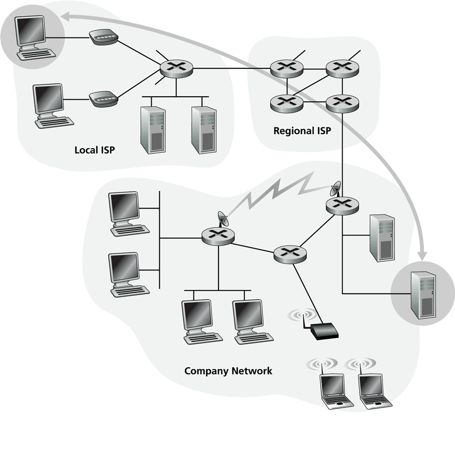
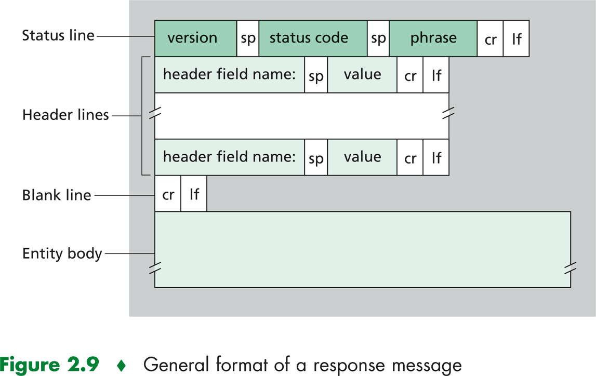
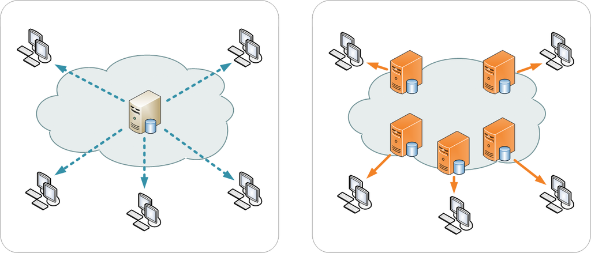
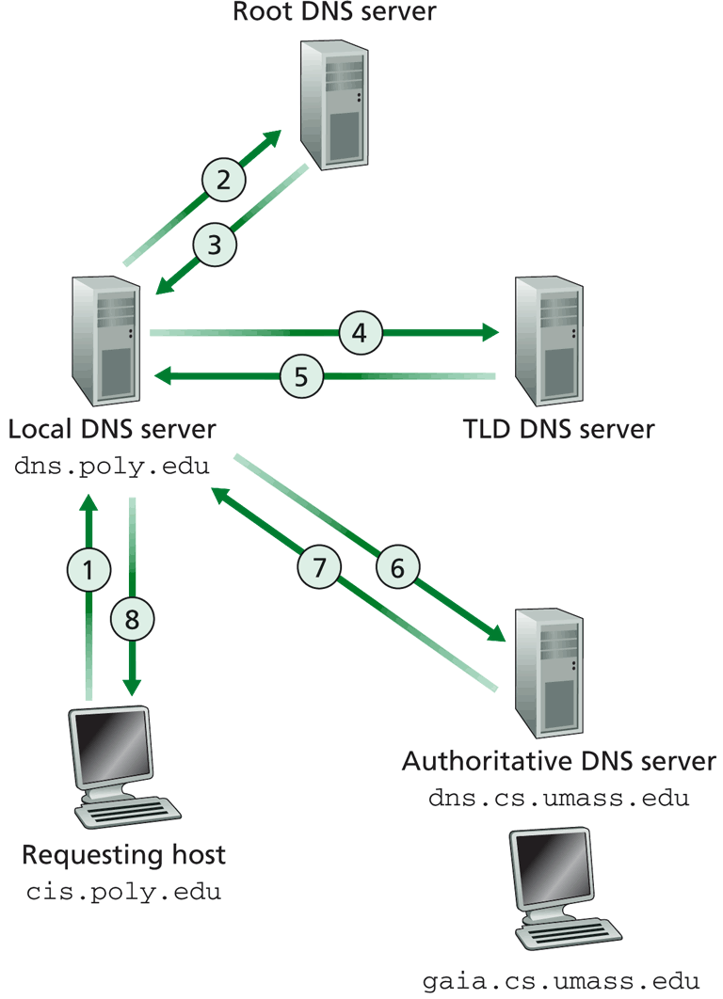
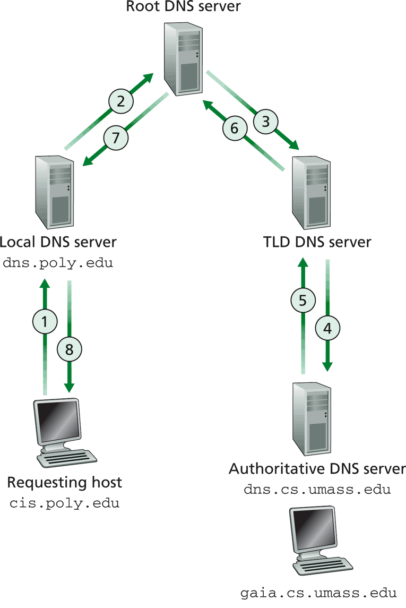
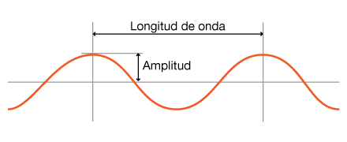
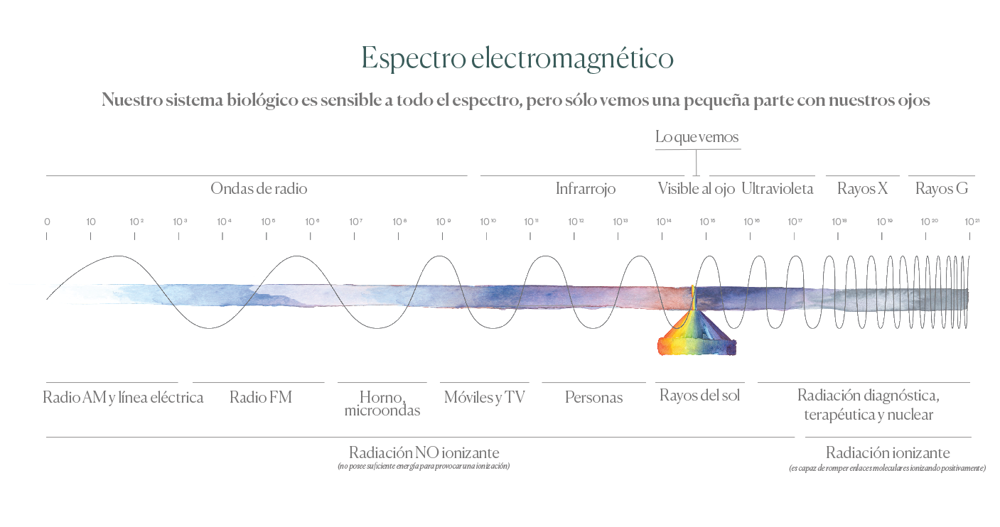
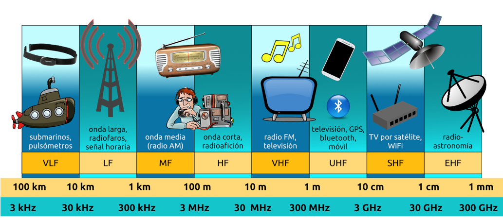
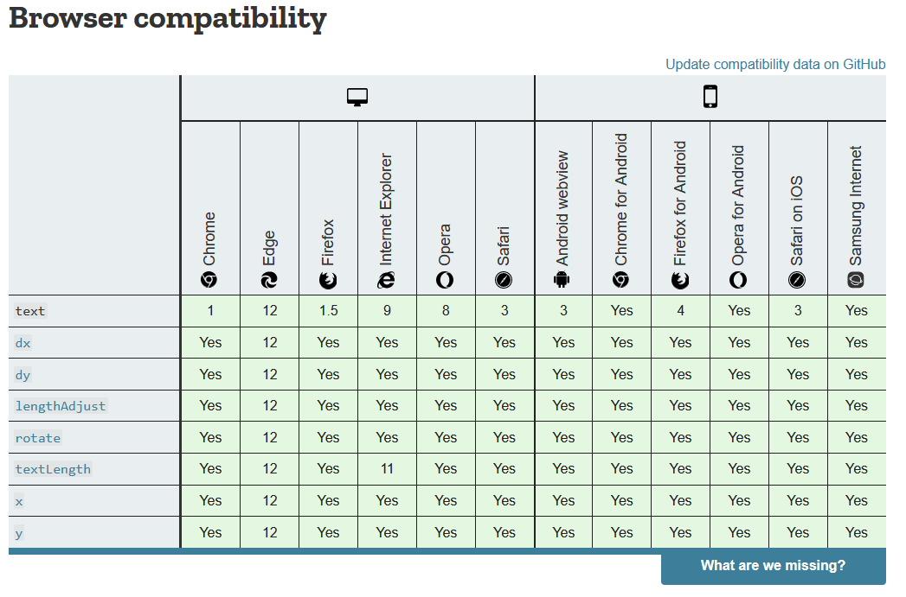

# Redes de Computadoras

# Introducción

Internet es una red de computadoras que interconecta a millones de dispositivos informáticos a lo largo del mundo.

A diferencia de la red telefónica, que durante años en la mayoría de los países estuvo a cargo de una sola compañía, Internet global consiste en decenas de miles de redes interconectadas operadas por proveedores de servicios, compañías individuales, universidades, gobiernos y otros.

Los estándares abiertos permiten que esta red de redes puede comunicar. Esto hace posible que cualquiera pueda crear contenido, ofrecer servicios y vender productos sin requerir el permiso de una autoridad central.

- [Internet Society](https://www.internetsociety.org/es/internet/)

## Componentes

### Frontera

(Hosts y aplicaciones)



Hasta hace algunos años los dispositivos conectados en internet eran principalmente PC's y servidores alojando páginas web y/o proveyendo servicios de mensajería de correo electrónico.

Actualmente cada vez más terminales no tradicionales están conectados a internet, entre los que se pueden mencionar televisores, consolas, dispositivos de seguridad, electrodomésticos inteligentes y por supuesto teléfonos inteligentes (smart phones).

Para denominar a estos dispositivos utilizaremos el termino hosts o sistemas terminales. Los sistemas terminales intercambian datos segmentandolos y añadiendo cierta información en la cabecera de cada segmento denominado paquete.
Una vez los paquetes arriban al sistema terminal receptor los reensambla para obtener los datos originales.

### Redes de Acceso

(Enlaces)

La comunicación se realiza mediante una red de enlaces de comunicaciones y dispositivos de conmutación de paquetes. Los enlaces estan compuestos por variados medios físicos, entre los que cabe mencionar cable coaxial, hilo de cobre, fibra óptica y el espectro de radio, cada uno de ellos con sus particularidades y distinta velocidad de transmisión.

### Nucleo

(Routers)

Un conmutador de paquetes toma el paquete que llega de uno de sus enlaces de comunicación de entrada y lo reenvía a uno de sus enlaces de comunicación de salida. Los conmutadores más utilizados en internet son los routers y los switches de la capa de enlace. La secuencia de enlaces de comunicaciones y conmutadores de paquetes que atraviesa un paquete desde el host emisor hasta el receptor se conoce como ruta.

## Servicios

Brindados mediante protocolos o API's

Todos los dispositivos conectados a Internet se comunican siguiendo determinados protocolos que controlan el envío y recepción de los datos. El protocolo TCP (Transmission Control Protocol) y el protocolo IP (Internet Protocol) son dos de los protocolos más importantes de Internet, y se los conoce colectivamente como TCP/IP.

Los protocolos juegan un rol fundamental en Internet, y para que todos estén de acuerdo en el modo de proceder se establecen estándares. Los estándares de Internet son desarrollados por el IETF (Internet Engineering Task Force).

Los documentos asociados a estos estándares IETF se conocen como documentos RFC (Request for Comments).

A su vez los programadores de aplicaciones de red brindan API's (Application Programming Interface), permitiendo así que otras aplicaciones interactuen con las funciones que se han implementado, pudiendo consumir servicios o reutilizar determinadas funciones y recursos.

Entre los servicios brindados en Internet se pueden destacar:

- El E-mail, uno de los primeros y más valiosos servicios desde el origen de las redes de computadoras.
- Acceso remoto.
- Transferencia de archivos.
- World Wide Web.

## Arquitectura

Dentro de los modelos de diseño de aplicaciones en la red
podemos encontrar dos grandes paradigmas:

- Cliente servidor
- P2P (peer to peer)

En el caso de la arquitectura cliente servidor hay dos categorías de hosts que cumplen un rol bien específico.
El servidor será un equipo de alta disponibilidad, accesible a traves de una IP fija, que brindará determinado servicio.
Por su parte el cliente se compondrá de equipos variados, probablemente con IP dinámica y haciendo uso del servicio de forma intermitente. En este caso los clientes realizarán peticiones al servidor, consumirán sus servicios, pero no interactuarán directamente con otros clientes.

En el caso de la arquitectura P2P (peer to peer), no se dispone de un equipo central, sino que los usuarios de la red funcionan como cliente o servidor de forma alternativa interactuando entre sí.

## Proveedores de Servicios

Los sistemas terminales acceden a Internet a través de los ISP ( Internet Service Provider). Cada ISP es compuesto por una red de conmutador de paquetes y enlaces de comunicación, esta red se comunica con otros ISP para lograr la intercomunicación que da lugar a Internet.

Servicios brindados:

- DSL: digital subscriber line
  - ADSL
  - SDSL
- HFC: Hybrid fiber coax
- Fiber to the home

### Tiers

Los proveedores de Internet mantienen una estructura jerarquica.
En el núcleo se encuentran los ISP Tier I, los cuales brindan servicios a nivel global y cuentan con enlaces de alta velocidad. Los ISP Tier I le brindan servicio de conexión a los Tier II (regionales) y estos a su vez a los Tier III (regionales y locales).

  Jerarquía de proveedores de servicios.

    - Tier I
    - Tier II
    - Tier III

## Enlaces

- [DSL Interference](http://www.arrl.org/dsl-interference)
# Flujo de datos

## Conmutación de Circuitos

La conmutación de circuitos realizan una reserva de recursos de extremo a extremo, por el tiempo en el que dura la sesión entre los sistemas terminales. Esto garantiza los parametros de calidad.

Se realiza una división del ancho de banda en secciones fijas, lo que se puede realizar dividiendo por frecuencia (FDM Frequency Division Multiplexing) o por tiempo (TDM, Time Division Multiplexing).

No se comparten recursos, si no se utilizan se desperdician.

## Conmutación de Paquetes

En la conmutación de paquetes se realiza una división en paquetes del flujo de datos.
Se intercambian mensajes, estos se transmiten a través de cada enlace a la velocidad de transmisión máxima del enlace utilizando el ancho de banda disponible. Los recursos se comparten permitiendo que más usuarios utilicen la red al mismo tiempo, por lo que la demanda puede exceder la disponibilidad, en muchos casos será necesario implementar medidas para el control de la congestión.

La forma en la que se intercambian datos en internet frecuentemente suele ser en forma de ráfagas, por lo que esta estrategia suele ser una buena opción. De todos modos es necesario utilizar protocolos para asegurar la transferencia de datos y controlar posibles congestiones.

## Throughput vs Bandwidth

El Bandwidth o Ancho de banda, es la máxima cantidad de datos que es posible transferir a travez de una conexión en determinado tiempo.

Por otra parte el Throughput, o tasa de transferencia efectiva, es el actual número de bits que es posible hacer fluír a traves de una conexión de red en determinado periodo de tiempo.

    Throughput <= Bandwidth

La tasa de transferencia será siempre menor o igual que el ancho de banda.

## Retardos y pérdidas


- Procesamiento en el nodo
- Encolamiento
- Transmisión
- propagación

Al llegar los paquetes se realiza un *Procesamiento en el nodo* que cuenta con un chequeo de paridad (CRC, verificación de redundancia cíclica) y a continuación se determinar el enlace de salida (enrutamiento).

Luego se colocan en una cola a espera del enlace de salida para la transmisión, el tiempo que aquí pasen depende del nivel de congestión del router.

A continuación se procede a la transmisión, lo cual también tiene un retardo que dependerá del ancho de banda del enlace y de la longitud del paquete.

Y finalmente el paquete viajará por el medio físico a una velocidad que dependerá de sus capacidades de propagación.

Vale destacar que los paquetes se encolan en los buffers de los routers si la tasa de arribos supera la capacidad del enlace la cola crece. Esto puede generar que se llene el buffer y se comiencen a perder paquetes.

### Resumen de fórmulas

Sea:

- R = ancho de banda del enlace
- L = Longitud del paquete
- a = promedio de arribos
- d = longitud del enlace físico
- s = velocidad de propagación

Tiempo de:

    en cola = La/R
    transmisión = L/R
    propagación = d/s

Producto ancho de banda-retardo:

    R * s

Retardo en cola ~= Intensidad del tráfico

En caso de que la intensidad del tráfico en el nodo supere la capacidad del enlace se perderán paquetes.
# Capas de red

La división en capas permite la modularización lo que facilita el mantenimiento y la realización de diagnósticos en la red.

- [Aplicación](./secciones/04_CapaDeAplicacion.md)
- [Transporte](./secciones/05_CapaDeTransporte.md)
- [Red](./secciones/06_CapaDeRed.md)
- [Enlace/Datos](./secciones/07_CapaDeEnlace.md)
# Capa de Aplicación

La capa de aplicación esta formada por programas que se ejecutan en sistemas terminales, hosts, conectados en red.

Una aplicación de red consta de parejas de procesos que se envían mensajes entre sí por medio de la red.

*Ejemplo: Un navegador Web Mozilla Firefox comunicándose con un servidor web Apache.*

Por lo general esta interacción se realiza de modo en que un host realiza una petición y utiliza un servicio brindado por otro host, donde al que realiza la petición (inicia la comunicación), se le llamará cliente y al que brinda el servicio (espera la comunicación de un proceso cliente), servidor. En el ejemplo anterior el navegador funciona como programa cliente y el servidor Apache tal como su nombre lo indica, de servidor.

Los procesos envían y reciben mensajes a través de sockets, lo cual se puede pensar como una puerta de comunicación. El proceso que envía datos deja mensajes en el socket y confía en el servicio brindado por las capas inferiores para que el mensaje llegue al proceso destino.

Cada host puede ser identificado por una dirección IP, pero para identificar a los procesos, ya que pueden ser muchos funcionando en un mismo host, es necesario otro identificador. Para esto se utilizan números que se asocian a los procesos, los cuales se denominan puertos.

Para que los mensajes sean entendidos por el servidor que los recibe, y correctamente respondidos, debe existir un protocolo, donde se definirán tipos de mensajes, campos y parámetros que deben ser enviados, así como el modo de hacerlo.

Entre estos protocolos pueden ser de dominio público o propietarios. Entre los de dominio público se encuentran los definidos en los RFC (Request For Comments), HTTP, SMTP, FTP, SSH, etc.

## Arquitecturas

El desarrollador de una aplicación debe pensar el mejor modo en que los hosts se comunicarán y que rol cumplirán. Uno de los grandes enfoques que se pueden tener en cuenta son las arquitecturas, en las que en Internet predominan: cliente servidor y P2P.

### Cliente servidor

En la arquitectura cliente servidor, el servidor es un equipo de alta disponibilidad, que aguarda por solicitudes de los clientes en una dirección IP fija. Por su parte los clientes pueden estar activos de forma intermitente. Normalmente un sólo host no es suficiente para responder a la solicitud de todos los clientes, así mismo no serían posible brindar la misma calidad de servicio para todos los rincones geográficos, para esto se suele implementar una granja de servidores (cluster), para crear un servidor virtual de alta capacidad, y se realiza una replicación en distintos puntos para mejorar la velocidad de acceso y la disponibilidad del servicio.

Por su parte los clientes se encuentran activos de forma intermitente, no tienen necesariamente IP fija y utilizan variado hardware y sistemas operativos, así como en el caso de la Wold Wide Web, pueden utilizar distintas aplicaciones para entablar la comunicación. Los clientes no se comunican de forma directa entre sí, sino que siempre lo harán a través del servidor.

Se debe notar que un sistema de gran porte con este tipo de arquitectura puede llegar a ser sumamente costoso, tanto desde el hardware, el ancho de banda y el mantenimiento a realizar. Actualmente existen servicios de máquinas virtuales en la nube donde se puede escalar una aplicación con gran facilidad y reduciendo costos, lo cual suele denominarse cloud service (servicio de nube).

Ejemplos de servicios en la nube:

- [Amazon Web Services (AWS) - Cloud Computing Services](https://aws.amazon.com/es/what-is-aws/)
- [Microsoft Azure - Servicios en la nube](https://azure.microsoft.com/es-es/overview/what-is-azure/)
- [Google Cloud Platform](https://cloud.google.com/docs/?hl=es)

Servicios brindados con esta arquitectura son:

- Correo electrónico
- Páginas web
- Almacenamiento de archivos centralizado

### Peer to Peer (P2P)

Por su parte una red P2P estará conformada por host que funcionarán como cliente y servidor de forma alternativa conectándose directamente entre sí. Este sistema es de muy alta escalabilidad, creciendo su disponibilidad de forma natural a la vez que aumenta la demanda. Por otro lado puede ser muy difícil de administrar y en la mayoría de los casos será necesario contar con algún servidor que facilite la conexión entre los pares y la localización de recursos.

Algunos servicios que utilizan esta arquitectura son:

- bittorrent
- Skype
- bitcoin
- SETI@Home

## HTTP

En la década de 1990 surgió la aplicación World Wide Web que revolucionó el uso de Internet y lo convirtió en un recurso fundamental para el público general.

El protocolo principal es el HTTP en el que se definen las funciones de un programa cliente y uno servidor. El funcionamiento básico es el pedido al servidor de un recurso página web, el servidor procesa la petición y retorna el archivo, y finalmente el navegador interpreta la estructura y lo muestra. Una página web es un contenedor de objetos estructurada en HTML (HyperText Markup Language), la cual puede hacer referencia a archivos multimedia, scripts y otros archivos.

Cada objeto es identificable por una dirección URL (Uniform Resource Locator). Se utiliza el protocolo TCP de la capa de transporte para realizar los pedidos y enviar las respuestas, por defecto los servidores web escuchan mediante el puerto 80 HTTP y 443 HTTPS.

Los mensajes intercambiados se pueden clasificar como pedidos (request) y respuestas (response).

### request


Ejemplo de request:

```HTTP
GET /tecnoinf HTTP 1.1
Host: www.fing.edu.uy
User-agent: Mozilla/4.0
Connection: close
Accept-language: es
```

### response



Ejemplo de response:

```HTTP
HTTP/1.1 304 Not Modified
Connection: Keep-Alive
Date: Thu, 15 Mar 2018 00:15:42 GMT
ETag: "32d-4de09aea58e40"
Keep-Alive: timeout=5, max=100
Server: Apache
```

Al momento de la realización de las peticiones se utiliza un conjunto de métodos para indicar la acción que se desea realizar para un recurso determinado. Aunque estos también pueden ser sustantivos, estos métodos de solicitud a veces son llamados HTTP verbs.

- GET
- POST
- HEAD
- PUT
- DELETE

El método **GET** es utilizado para solicitar datos, las peticiones realizadas a través de este método pueden ser cacheadas y almacenadas en el historial del navegador. No es utilizado para el envío de datos sensibles, como credenciales, por el hecho de que los parámetros viajan en la ruta, por otro lado eso mismo lo hace muy útil para ser utilizado en filtros.

Por su parte el método **POST**, es utilizado para el registro de datos, la información enviada viaja en el cuerpo del mensaje y no tiene limites de tamaño. en este caso las peticiones nunca son cacheadas.

Las peticiones son respondidas por parte del servidor junto a un [código de estado](https://developer.mozilla.org/es/docs/Web/HTTP/Status "Códigos de estado de respuesta HTTP") que indica si el procedimiento fue exitoso o no. Las respuestas se agrupan en cinco clases: respuestas informativas, respuestas satisfactorias, redirecciones, errores de los clientes y errores de los servidores.

### Códigos de estado

#### Respuestas informativas

100 Continue

Esta respuesta provisional indica que todo hasta ahora está bien y que el cliente debe continuar con la solicitud o ignorarla si ya está terminada.

101 Switching Protocol

Este código se envía en respuesta a un encabezado de solicitud Upgrade por el cliente e indica que el servidor acepta el cambio de protocolo propuesto por el agente de usuario.

102 Processing

Este código indica que el servidor ha recibido la solicitud y aún se encuentra procesandola, por lo que no hay respuesta disponible.

#### Respuestas satisfactorias

200 OK

La solicitud ha tenido éxito. El significado de un éxito varía dependiendo del método

201 Created

La solicitud ha tenido éxito y se ha creado un nuevo recurso como resultado de ello. Ésta es típicamente la respuesta enviada después de una petición PUT.

202 Accepted

La solicitud se ha recibido, pero aún no se ha actuado.

#### Redirecciones

301 Moved Permanently

La respuesta indica que la URI de la petición ha cambiado, posiblemente se incluya en la respuesta la nueva ubicación.

#### Errores de cliente

400 Bad Request

El servidor no puede entender la petición o contiene una sintaxis inválida

404 Not Found

El recurso no ha sido encontrado

#### Errores de servidor

500 Internal Server Error

### Cookies

Las cookies son datos que el servidor envía junto con la respuesta al navegador, estos datos se enviarán junto con las siguientes peticiones, lo que permite realizar un seguimiento de estado sobre el protocolo HTTP el cual no contiene estado. Por lo general es utilizado para mantener una sesión de un usuario (Autenticación - logged-in), así como para mantener información de acciones realizadas.

Es posible asignarles un tiempo máximo de vida, que expiren al cerrar el navegador o realizar un borrado manual (cerrar sesión) por parte del servidor.

Así mismo cuenta en algunos casos con mala reputación por el uso que se le puede dar de realizar seguimiento en los hábitos de navegación con fines de recopilación de datos para diversos usos. En algunos casos es posible utilizar otros mecanismos para guardar información en el cliente, como el uso de [Web Storage](https://developer.mozilla.org/en-US/docs/Web/API/Web_Storage_API "Web Storage API").

### Caché web

El caché web almacena documentos web para reducir el ancho de banda consumido, la carga de los servidores y el retardo en la descarga.

- privados
  - Funcionan para un único usuario
- compartidos
  - Utilizados por proveedores de servicios e instituciones para ahorrar ancho de banda.
- pasarela
  - Funcionan a cargo del servidor original, pueden implementar una CDN (Content Delivery Network)

Lo que hace viable el uso del un web cache es la existencia de un GET condicional, lo que se logra a través de un campo en la cabecera `if-modified-since` que en caso de que no se haya modificado el objeto desde la fecha pasada se retorna únicamente la cabecera con código 304 cargando el documento previamente almacenado en caché, de lo contrario se envía todo el documento.

Esto puede ser muy útil para ahorrar ancho de banda para proveedores de servicios, tales como instituciones educativas o empresas, por lo que puede ser que cuenten con un servidor proxy que satisfaga las peticiones del cliente sin involucrar el servidor original.

Se puede configurar el navegador para que acceda mediante chaché. El navegador envía todos los pedidos al  caché, si el objeto se encuentra se devuelve del caché Si no se encuentra se obtiene del cliente original, se guarda en el server proxy y se devuelve al usuario.


Otro ejemplo de implementación de este tipo es el caso de los CDN (Content Delivery Network), en el que se cuenta con una copia de los datos de forma distribuida en distintos puntos de la red.

Un cliente accede a los datos desde un nodo cercano, reduciendo así el tiempo de respuesta y la pérdida de información, y reduciendo la carga de los servidores.



## API

Application Programming Interface

Interfaz mediante la cual un software brinda determinados servicios para ser consumidos por otra aplicación.
Contiene un conjunto de reglas y especificaciones para que los programas se puedan comunicar.

### Web APIs

Conjunto de Especificaciones que determinan el modo de realizar una petición (request message),
y la estructura de respuesta que se espera obtener (response).

Usualmente se utiliza el formato XML (Extensible Markup Language) o JSON (JavaScript Object Notation).

#### SOAP

Especificación de protocolo para el intercambio de mensajes.
Protocolo basado en XML consistente en:

- Una envoltura o sobre, que define la estructura del mensaje y el modo de procesarlo.
- Un conjunto de reglas para representar instancias de tipos
- Una convención para representar peticiones y respuestas

Características:

- Expansibilidad
- Neutralidad (puede operar sobre diversos protocolos como HTTP, SMTP)
- Independencia

Una de sus mayores desventajas es que la serialización y des serialización de XML puede tener un gran impacto de performances.

#### REST (REpresentational State Transfer)

Mejora la performance, escalabilidad y es más flexible.
Se utilizan las operaciones disponibles en HTTP

- GET
- POST
- PUT
- DELETE, etc.

Las funcionalidades y los datos son considerados como recursos, accesibles mediantes URIs (Uniform Resource Identifiers)

Ejemplo: `/alumnos/32` (recurso alumno con identificador 32)

Se cumplen determinados principios para que una aplicación sea simple, ligera y rápida.

- Identificación de recursos mediante URI
- Interfaz uniforme
- Mensajes auto descriptivos
- Interacción estática

## DNS

Los usuarios utilizan nombres fáciles de recordar para acceder a los servicios que brindan los hosts en lugar de la dirección IP. Para que esto sea posible debe existir un sistema que realice una traducción de dichos nombres en las direcciones IP, y esa es la principal tarea del Domain Name System `DNS`.

Se trata de una base de datos distribuida implementada en una jerarquía de servidores, junto a un protocolo de la capa de aplicación que permite consultar los registros.

Por ejemplo al momento de acceder a un sitio, el navegador realiza una consulta a un cliente DNS que corre en el propio equipo, el cliente DNS envía la consulta con el nombre de host a un servidor DNS el cual retornará, entre otra información útil, la dirección IP correspondiente al nombre de host consultado.

La elección de una base de datos descentralizada se da por entre otros factores en el hecho de evitar un punto de falla único, dado que la función que se brinda es vital para el correcto uso de la World Wide Web, así como que sería muy difícil soportar el elevado volumen de tráfico. De este modo se mejora el mantenimiento, la escalabilidad del sistema, y el acceso sin mayor retardo desde los distintos rincones del planeta.

### Servicios DNS

Además de la traducción de nombres en direcciones IP se proporcionan otros servicios importantes.

Hay equipos que por motivos administrativos u otras cuestiones cuentan con un nombre complicado, que tampoco los hace muy fácil de utilizar, el servicio DNS puede realizar un  **alias de host** para esto se utiliza un registro `CNAME`. A su vez es posible que se desee acceder a un sitio mediante pequeñas variantes de forma transparente para el usuario, por ejemplo, www.misitio.com.uy puede enlazar con www.misitio.uy

Así mismo sucederá que el propietario del sitio misitio.uy quiera tener un correo @misitio.uy, en este caso se podrá hacer mediante un registro `MX`. Cabe destacar que el host para alojar el sitio web no necesariamente será el mismo que alojará el servidor de correo electrónico.

DNS también es utilizado para distribuir la carga de un sitio distribuido. En casos en los que un servicio recibe una gran carga de tráfico se utilizan replicas en hosts distribuidos, cada uno con su propia IP. En este caso el servidor DNS devolverá una lista de direcciones IP rotando su orden, distribuyendo el tráfico entre los distintos hosts disponibles.

### Jerarquía


La base de datos está distribuida al rededor de todo el mundo y de forma jerarquizada. Ningún servidor cuenta con todos los registros, sino que existen distintos niveles de dominio.

Por ejemplo, se desea acceder al sitio www.tecnologo.com. En primer lugar el cliente deberá recurrir a uno de los servidores raíz, este le devuelve las direcciones IP para los servidores TLD .com. Al consultar uno de estos servidores se retornará la dirección o las direcciones IP de un servidor autoritativo para tecnologo.com. Así el cliente puede consultar a uno de los servidores autoritativos para tecnologo.com el cual le devolverá la IP correspondiente al host www.tecnologo.com.

#### Servidores DNS raíz

Existen 13 servidores DNS raíz, nombrados con letras desde la A hasta la M. Cada uno de estos servidores se encuentra replicado en distintas ubicaciones geográficas, tanto por motivos de seguridad como de fiabilidad.

#### Servidores TLD (Top Level Domain)

Los servidores TLD son responsables de los dominios de nivel superior como, .com, .net, .edu y todos los dominios de nivel superior de los paises, tales como .uy, .uk, .fr, etc.

#### Servidores DNS autoritativos

Las organizaciones que cuenten con hosts accesibles desde Internet deben proporcionar un listado de sus hosts dentro del dominio, esto se hace a través de los servidores autoritativos brindando registros DNS que corresponden nombres de hosts con direcciones IP.

#### Servidor DNS local

Fuera de la jerarquía antes mencionada existen servidores DNS locales mantenidos por los proveedores de servicios, de este modo el servidor local puede resolver consultas realizadas por los usuarios, almacenar las respuestas en el caché y brindar una respuesta más rápida en próximas peticiones. De este modo actúa como proxy, reenvía la consulta a la jerarquía de ser necesario.

### Resolución iterativa



### Resolución recursiva



### Registros DNS

Los servidores DNS almacenan los **registros de recursos** con cuatro campos:

- Nombre
- Valor
- Tipo
- TTL

El campo TTL es el tiempo de vida del registro, determina cuando un recurso debería ser eliminado del caché.

En el caso del campo tipo los valores pueden ser:

#### Tipo A

- Nombre: el del equipo
- Valor: dirección IP

#### Tipo NS

- Nombre: el dominio
- valor: El nombre del servidor autoritativo para el dominio.

#### Tipo CNAME

- Nombre: alias para un nombre “canónico” real. www.ibm.com es realmente servereast.backup2.ibm.com
- Valor: el nombre canónico real

#### Tipo MX

- Valor: el nombre del servidor de
- correo asociado con el nombre.

Entre otros: PTR, SOA, HINFO, TXT, LOC, WKS, SRV, SPF

## Enlaces

- [DNS | Root servers](http://root-servers.org)
- [DNS | Consultas recursivas e iterativas](https://technet.microsoft.com/en-us/library/cc961401.aspx)
# Capa de Transporte

La capa de transporte cumple un rol fundamental en la comunicación entre procesos en hosts separados en la red.

La capa de red, sobre la que se encuentra, cumple el rol de proporcionar una comunicación lógica entre hosts, mientras que la de transporte lo hará entre procesos de distintos hosts. Los protocolos de transporte se ejecutan en los sistemas terminales.

En el emisor se generarán segmentos a partir de los mensajes de la aplicación y los pasa a la capa de red. El receptor a partir de los segmentos recibidos, se encargará de proporcionar mensajes a la capa de aplicación al proceso que corresponda.

Los protocolos disponibles desde la capa de transporte a la capa de aplicación en Internet son UTP y TCP.

## UDP (User Datagram Protocol)

Protocolo de transporte ligero, simple, no orientado a la conexión definido en el RFC 768.

No existe una fase de establecimiento de conexión por lo que se dice que es un protocolo sin conexión.


- servicio de transferencia de datos no fiable
(sin garantía de que los datos lleguen al receptor)
- Los mensajes pueden llegar en forma desordenada
- Sin control de congestión
(se pueden introducir datos en la capa inferior a la máxima velocidad)
- No aporta mucho más de lo que ya hace el protocolo IP de la capa de red.

## TCP (Transmission Control Protocol)

Protocolo de la capa de transporte fiable y orientado a la conexión.


- Confiable, orientado a la conexión, entrega en orden.
- control de congestión
- control de flujo
- establecimiento de la conexión

Para esto cuenta con:

- Mecanismos de detección de errores
- Retransmisiones
- Reconocimientos acumulativos
- Temporizadores
- Números de secuencia y de reconocimiento

Se encuentra definido en los RFC’s [793, 1122, 1323, 2018, 2581]

### Acuerdo en tres fases

Un proceso en el host A desea iniciar una conexión con otro proceso que se ejecuta en el host B.


1. El proceso cliente se comunica con la capa de transporte para que envíe al host B un primer paquete con el campo *SYNchronize*.
2. El host B recibe el paquete y responde con un paquete *SYNchronize-ACKnowledgement* el cual es recibido por el host A.
3. Al recibir el *SYN-ACK*, A envía un *ACKnowledge*, el cual podrá contener carga útil y al ser recibido por B dejará establecida una conexión de sockets TCP

En este momento se negocian:

- buffers
- MTU (Maximum Transmission Unit)
- MSS (Maximum Segment Size) tamaño máximo de datos que pueden colocarse en un segmento.

`MSS = MTU – cabecera TCP – cabecera IP`

El valor por defecto del MSS es de 536 bytes, en caso de que se desee setear el valor del MSS en otro valor se debe especificar como una opción TCP en el paquete SYN durante el `handshake`.
Este valor no podrá ser cambiado luego de que se establezca la conexión.

### Segmento TCP

- puerto origen y destino
- checksum
- numero de secuencia
- ventana de recepción
- longitud de cabecera
- opciones
- indicador
  - URG
  - ACK
  - PSH
  - RST
  - SYN
  - FIN

#### Número de secuencia

Número del primer byte del segmento dentro del flujo de bytes.
Si el host A envía vía TCP un archivo de 500.000 bytes, siendo el MSS 1000 bytes numerando el primer byte como 0.
TCP construirá 500 segmentos a partir del flujo de datos.

- primer segmento 0
- segundo segmento 1000
- tercer segmento 2000

#### Número de reconocimiento

Acknowledgement number

Número de secuencia del siguiente byte que el host espera recibir.
Host A recibe el segmento 0 a 999, responderá con un ACK en el que el número de reconocimiento será 1000.

En caso de que reciba el 2000 a continuación de todos modos enviará un ACK number 1000, dado que TCP maneja reconocimientos acumulativos.

### Estimación RTT

Para recuperarse de la pérdida de segmentos se debe contar con un mecanismo de retransmisión, y para ello con un temporizador.
para
Se genera un RTTMuestra a partir de un segmento transmitido.

Esta muestra cambiará cada RTT segundos, y no se calcula en para las retransmisiones, en base a esta muestra se calcula un RTTEstimado.
El temporizador será mayor o igual que RTTEstimado, pero no menor, ya que se generarían retransmisiones innecesarias ni mucho mayor para poder retransmitir un segmento sin mayor demora.


## Servicios no disponibles

- Garantías de retardo
- Garantías de ancho de banda

## Multiplexación y Demultiplexación

Pueden existir muchas aplicaciones corriendo en simultaneo en un mismo host. Ej: HTTP, telnet, FTP, SMTP. Cuando la capa de transporte recibe datos procedentes de la capa de red, tiene que dirigir los datos a el proceso correcto.

Un proceso puede tener uno o más de un socket La capa de transporte no entrega los datos directamente al proceso, sino que los “deposita” en un socket Los sockets tienen un número identificador único. Esta tarea es la que se denomina Desmultiplexación.

En el host emisor la capa debe reunir los fragmentos de datos
desde los sockets y encapsular cada fragmento de datos con determinada información de cabecera. La información de la cabecera (header) es lo que luego se utilizará en el proceso de desmultiplexación. Una vez creado el segmento es pasado a la capa de red.

El formato del identificador varía entre sockets UDP y TCP.

### Sin conexión

Para que un host pueda ser identificado desde un host remoto basta la tupla dirección IP, número de puerto puerto. Así un proceso en el host A, con el puerto UDP 28340, se podría comunicar con el host B al puerto 9876.

La capa de transporte del host A crea un segmento incluyendo los datos
de la aplicación, puerto origen y puerto destino. Se pasa el segmento a la capa de red la cual lo encapsula en un datagrama, haciendo el máximo esfuerzo por entregar el segmento al host receptor. En caso de llegar la capa de transporte del host B examina el número de puerto y entrega el segmento al socket identificado con el puerto.

### Orientada a la conexión

El Socket TCP se identifica por 4 elementos.

- Dirección IP origen
- Número de puerto origen
- Dirección IP destino
- Número de puerto destino

El host destino utiliza los 4 valores para dirigir el segmento al socket apropiado, el host servidor debe soportar varios sockets TCP simultáneos, en este caso se creará un nuevo socket para cada cliente que se conecta, pero las conexiones siempre serán dirigidas al mismo número de puerto.
# Capa de Red

## Introducción

La capa de red, implementa el **servicio de comunicación host a host**.
A diferencia de las capas superiores las cuales se encuentran únicamente en los sistemas terminales, la capa de red se encuentra también en el núcleo de la red. Por otra parte es la capa más baja en encargarse de recibír datos de una computadora a otra, incluso estando estas en redes diferentes.

El host emisor encapsula segmentos en **datagramas**, los routers que se encuentran en la ruta entre ambos hosts examinan los datagramas que reciben.
En el host destinatario, la capa de red recibe de su router más cercano el datagrama y le entrega el segmento que contiene a la capa de transporte.

Entre las principales tareas:

- Descubrir la topología de la red
- Encapsular los datos de la capa de transporte dentro de unidades de datos de la capa de red (datagramas)
- Manejar la conectividad y el ruteo entre hosts y redes

- Se debe comunicar con la capa de transporte
- Se debe comunicar con la capa de enlace

## Redes de circuitos virtuales y de datagramas

Las arquitecturas principales de esta capa son **Las redes de circuitos virtuales** y las **redes de datagramas**. Las redes de circuitos virtuales proveen un servicio de conexión de capa de red, se brinda un camino desde un origen hacia un determinado destino, en el cual los recursos son reservados para garantizar determinado nivel de servicio. Por su parte las redes de datagramas no brindan un servicio de conexión, y los paquetes son reenviados según la dirección de destino, pudiendo atravesar algunos paquetes un camino mientras que otros podrían tomar otra ruta.

## Routers

Un router es un equipo especializado conectado a más de una red. Ejecuta un software que le permito mover datos desde una red a otra. Entre sus funciones principales se encuentran, restringir broadcast, servir de enlace entre distintas redes (default gateway), y estimar la mejor ruta implementando algoritmos de enrutamiento. Así basándose en estos algoritmos de enrutamiento deben poder realizar un reenvío de los datos que reciben.

Los puertos de entrada de un router son el punto de recepción a nivel de bit, y allí se implementa la capa física y la capa de enlace. Una vez recibido un datagrama se necesita utilizar una tabla de reenvío interno que puede estar en la memoria del puerto.

En caso de recibir paquetes más rápido de lo que es posible procesarlos se encolarán en buffers hasta que puedan ser emitidos. La tasa de conmutación es la capacidad de transferir paquetes de los puertos de entrada a los de salida, es deseable que la tasa de conmutación sea igual a la tasa de entrada por enlaces.

De recibirse más paquetes de los que se emiten se procederá a almacenarlos en buffers, lo que generará retardos por encolamiento y posiblemente perdidas de paquetes en caso de producirse un desbordamiento (overflow) en el buffer.

## IP

IP es parte de un conjunto de protocolos de comunicación que proveen identificación global única.

la primer versión implementada en producción, en ARPANET, es **IPv4** y es la que funciona en la mayor parte de los sistemas al día de hoy. Utiliza direcciones de 32 bits (232 = 4.294.967.296) de las cuales muchas son reservadas a propósitos específicos.

- redes LAN
- broadcast
- auto referencia

### IP v6

La gran cantidad de dispositivos conectados a Internet han agotado las reservas de direcciones provistas por la IANA (Internet Assigned Numbers Authority) por lo que se ha impulsado la implementación de su remplazo IP v6. La nueva versión utiliza direcciones de 128 bits, cabecera de largo fijo de 40 bytes, no permite fragmentación y se eliminó el checksum así como las opciones dentro del cabezal, logrando así además de ampliar el número posible de direcciones de forma astronómica, mejorar el rendimiento del protocolo.

Al ser imposible cambiar el protocolo de un momento a otro ya que aún existen muchos equipos incompatibles, se utilizan técnicas de tunelización, en donde los datagramas IPv6 viajan dentro de la carga útil de datagramas IPv4 en los trechos donde no es posible utilizarlo.

### Datagramas

- **Número de versión:** 4 bits donde se especifica la versión, así el router sabrá como identificar el resto del datagrama.
- **Tamaño de la cabecera:** Se puede contener un número variable de opciones por lo que este campo especifica en que posición comienzan los datos. (por lo general la cabecera tiene  un tamaño de 20 bytes.
- **TOS (Tipo de servicio):**

### Direccionamiento

Generalmente un host tiene un único enlace hacia la red, cuando IP desea comunicarse lo hace a través de este enlace. El límite entre el host y el enlace físico se denomina interfaz.

Un router tendrá 2 o más enlaces, ya que su función así lo requiere. Cada interfaz de host y de router debe tener su propia dirección IP. La dirección IP se asocia a una interfaz.

Una dirección IP puede ser obtenida de forma manual, por parte de un administrador, o de forma dinámica, mediante el protocolo **DHCP** (Dynamic Host Configuration Protocol).

- El host manda un mensaje de difusión (broadcast) **DHCPDISCOVER**
- El servidor DHCP responde con mensaje de **DHCPOFFER**
- El host solicita dirección IP mediante un mensaje **DHCP request**
- El servidor DHCP envía la dirección de regreso en un mensaje **DHCP ACK**

Otra información útil brindada por el servidor DHCP será:

- Máscara de subred
- Dirección del gateway predeterminado
- dirección de servidor DNS local

Además es posible realizar una configuración de modo que un host siempre reciba la misma IP, o una dirección IP temporal.

El proveedor de internet no será el encargado de brindar este servicio a una LAN, sino, que brindará una IP la cual será utilizada en conjunto por los host de la subred al mundo exterior. Para lograrlo se utiliza una tabla **NAT** *(Network Address Translation)* en la que se realiza una traducción entre IP origen y número de puerto con un correspondiente NAT.

Para los datagramas Salientes:
Se reemplaza la IP origen y el número de puerto de cada datagrama por la dirección IP NAT y un nuevo número de puerto. Los clientes y servidores remotos responderán con la dirección destino NAT y el número de puerto determinado.

Para los datagramas entrantes:
Se debe reemplazar la dirección NAT y el puerto ahí establecido por el original, guardado en la tabla.

De este modo todos los datagramas que dejan la red local tienen la misma dirección, con diferente número de puerto, mientras que los datagramas que circulan dentro de la red se comportan de forma "normal". Así es posible modificar las direcciones de los dispositivos en la red interna sin notificar al mundo exterior.

Los números de puerto son de 16 bits, por lo que se soportan más de 60.000 conexiones simultaneas con una misma dirección IP. Para muchos resulta una falta al propósito de los puertos, pero por otro lado es una solución momentánea a la limitación de direcciones de IPv4, lo que sería solucionado con la implementación de la versión 6.

#### Subred

Las direcciones IP se dividen de modo en que con una parte se representa a la **subred** (bits más altos), mientras que el resto determinan el host, (bits más bajos). Una sub red puede alcanzarse físicamente sin la intervención de un router, y los dispositivos conectados a ella tienen la misma sección de subred en sus direcciones IP.

La **máscara de subred** se utiliza para delimitar el ámbito de una red y así un host saber si debe enviar paquetes dentro de la red o fuera.

Indica que parte de la IP:

- hace referencia a la red
- y que parte hace referencia al host.

Considerando un rango de direcciones desde 223.0.0.0 hasta 223.255.255.255 siendo parte todas ellas de la misma red se podría expresar:

    255.0.0.0
    223.0.0.0/8
    11111111 00000000 00000000 00000000

### ICMP

Protocolo de Mensajes de Control de Internet, utilizado principalmente para la generación de mensajes de error, o para mensajes de control de infraestructura tales como las solicitudes y respuestas de eco (ping).

Los mensajes se envían como carga útil de IP ICMP se especifica como el protocolo de la capa superior. Los mensajes cuentan con un campo tipo y un campo código y contienen la cabecera y los primeros 8bytes del paquete que produjo el error.

## Algoritmos de enrutamiento

Los algoritmos de enrutamiento son utilizados para determinar las tablas de reenvío de los routers y de ellos depende poder encontrar buenas rutas desde el emisor hasta el receptor a través de la red de routers.

Estos algoritmos se pueden agrupar entre dos tipos, algoritmos de enrutamiento global, en los que se utiliza el conocimiento global y completo de la red entre los que está el algoritmo **LS** (*Link Status*), y algoritmos descentralizados, donde el costo se calcula de forma iterativa y distribuida, como es el caso de **DV** (*Distance Vector*).

### Link Status

En el caso de este algoritmo la topología de la red y los costos de todos los enlaces son conocidos, cada nodo difunde paquete de estado de enlace conteniendo identidades y costes de sus enlaces conectados.

Algoritmo de Dijkstra

- Iterativo: Una iteración por cada nodo en la red
- Obtiene el costo mínimo desde un nodo a los demás

Notación:

- **c(x, y):** costo del enlace. ∞ si los nodos no son vecinos.
- **D(v):** mínimo valor calculado hasta el momento desde el origen al nodo v.
- **p(v):** Nodo predecesor en el camino del origen a v.
- **N’:** Conjunto de nodos cuyo costo mínimo es conocido hasta el momento.

Implementación:

Inicialización:

N’ =  {u}
Para cada nodo v

    Si v es vecino de u
        entonces D(v) = c(u,v)
    Sino D(v) = ∞

Loop

    Encontrar w que no esté en N’ tal que D(w) es mínimo
    Agregar w a N’
    actualizar D(v) para cada v adyacente a w y que no esté en N’ tal que:
    D(v) = min( D(v), D(w) + c(w,v) )

Hasta que todos los nodos estén en N’

### Distance Vector

El algoritmo por vector de distancias es distribuido, de tal modo que cada nodo recibe información de sus vecinos, realiza un cálculo y luego distribuye el resultado a sus vecinos. Esto se repite  hasta que no hay más información que intercambiar.

No es necesario que todos los nodos operen de forma sincronizado, por lo que se dice que es asíncrono.

La ecuación que se caracteríza con este sistema es la de Bellman-Ford.

dx(y) := costo del camino de menor costo entre “x” e “y”

    dx(y) = min { c(x,v) + dv(y) }

Cada iteración local es causada por un cambio en el costo local de un enlace, o un mensaje de actualización de V.D. de un vecino. Así cada nodo notifica cuando se modifica su V.D. y los vecinos notifican a sus propios vecinos en caso de ser necesario. Los nodos esperan cambios en los enlaces o mensajes de sus vecinos, en ese caso se recalculan las estimaciones y si algún vector de distancias cambia, se realiza la notificación.

### Enrutamiento jerárquico

En la práctica los algoritmos de enrutamiento se administran de forma jerárquica, de modo que los administradores de red puedan decidir que algoritmos utilizar, además de resultar inviable aplicar un algoritmo de forma global, calcular las rutas a través de la totalidad de Internet sería imposible, sólo la sobrecarga de trafico para difundir las actualizaciones LS de los routers abarcaría gran parte del ancho de banda, además del retardo de propagación de los datos generaría inconsistencias.

Para resolver estos problemas los routers son organizados en sistemas autónomos, los cuales contaran con un control administrativo independiente, utilizando determinado protocolo de enrutamiento interno (*protocolo Intra-AS*).

Entre los protocolos Intra-AS destacan:

#### RIP

(*Routing Information Protocol*)

- Costos en número de hops (máximo 15)
- Algoritmo DV
- Mensajes sobre UDP

#### OSPF

(*Open shortest path first*)

- Algoritmo Link State
- Se utiliza un inundado de paquetes
- Mensajes sobre IP

#### BGP

Por su parte para el enrutamiento Inter-AS en Internet se utiliza un protocolo común denominado **Border Gateway Protocol** *(BGP)*. Este protocolo debe proveer buenas rutas hacia otras redes basado en la topología de los AS's y la política utilizada. Además permite a una subred comunicar de su existencia al resto de Internet.

Los algoritmos RIP y OSPF mantienen su principal objetivo en la eficiencia y velocidad de las rutas provistas, el BGP agrega un control de trafico dependiendo de determinadas políticas que no son tan importantes en la configuración interna de un mismo AS.

## Enlaces

- [TCP/IP Guide Layer 3](http://www.tcpipguide.com/free/t_NetworkLayerLayer3.htm)
- [Fragmentación](https://electronicspost.com/ip-datagram-fragmentation-with-example/)
- [Fragmentación offset](https://ipwithease.com/fragmentation-offset/)
# Capa de Enlace

Hosts y routers son **nodos**, los canales de comunicación que conectan nodos adyacentes a través de caminos de comunicación son enlaces.

El paquete de capa de enlace, denominado **frame** o **trama**, encapsula un datagrama.

La capa de enlace tiene la tarea de transferir datagramas desde un nodo a otro nodo **adyacente**, a través de un enlace.

Esta capa se implementa en todos los host en el adaptador de red **NIC** *(Network Interface Card)*, y allí se implementa también la capa física.

## Servicios

- Entramado
- Acceso al enlace
  - Acceso al canal si es un medio compartido
  - Direcciones MAC, utilizadas en los encabezados de las tramas

- Entrega confiable:
  - Entre nodos adyacentes
  - Principalmente en enlaces inalámbricos.

- Control de flujo:
  - Acuerdo entre los nodos emisor y receptor

- Corrección de errores:
  - El receptor identifica y corrige errores sin necesidad de retransmisión
- Half-Duplex y Full-Duplex:
  - Posibilidad de transmitir al mismo tiempo o no.

## Entramado (framing)

El comportamiento básico es en el lado emisor el encapsulamiento del datagrama en un frame, agregando encabezado (header) con chequeo de error, control de flujo, entre otros parámetros posibles, y una cola (trailer) dependiendo del protocolo, lo que permite conocer el fin de la transmisión de una trama y en algunos casos es donde se establece el control de errores.

Al llegar al receptor se buscarán errores, se realizará un control del flujo y posiblemente alguna señalización. Se extrae el datagrama y se pasa a la capa superior.

## Errores, detección y corrección

En una transmisión de datos pueden aparecer errores causados por atenuación de señal o ruido en el medio. Dependiendo del enlace utilizado el protocolo deberá tener mayores o menores controles de detección de errores, en el caso de la fibra óptica la atenuación es baja y el ruido prácticamente nulo, mientras que en el espectro magnético ocurre lo contrario.

El receptor deberá detecta errores, el informar al emisor y/o descarta la trama dependerá del protocolo. La detección de errores no es 100% confiable, hay casos en los que el protocolo puede perder algunos errores. En algunos casos además de detectar errores se podrá recuperar de ellos, para esto se utiliza determinada redundancia **EDC** (*Error Detection Correction*), estos bits por lo general protegen determinados campos de cabecera, y mientras mayor sea el campo mejor es la detección y posible corrección, pero a su vez mayor sobrecarga de datos.

## Protocolos de acceso múltiple

La mayor complejidad dentro de los protocolos de acceso al medio, **medium access control** (*MAC*), de la capa de enlace la tienen los protocolos de acceso multiple al medio (*multiple access protocols*), en los cuales existen dos o más transmisiones simultáneas, aquí se puede dar que un nodo reciba varias señales al mismo tiempo, o que se de la simultaneidad en tiempo y frecuencia de dos o más tramas en el mismo medio físico, lo que generará una **colisión**, y por lo tanto perdida de datos.

Así la tarea de los protocolos de acceso múltiple es la de determinar cómo los nodos comparten el canal y cuando cada uno puede transmitir, lo que debe ser realizado utilizando el mismo canal.

Una idealización de un protocolo de acceso múltiple consistiría en que:

- Cuando un nodo quiere transmitir, lo hará a una velocidad R
- Cuando M nodos quieren transmitir, cada uno enviará a una velocidad promedio de R/M
- Completamente descentralizado:
  - No hay un nodo especial para coordinar las transmisiones
  - No hay sincronización de relojes, slots
- Que sea simple

### Tipos de protocolos MAC

Existen diferentes tipos de protocolos MAC, los cual podríamos agrupar en protocolos de, **particionado del canal, acceso aleatorio y toma de turnos**.

Los protocolos de **particionado** del canal se implementan en base a una estratégia estática, se divide el canal en pequeñas piezas, las cuales pueden ser ranuras de tiempo, rangos de frecuencias o determinado código y asignando le a un nodo determinada pieza de forma exclusiva. Este sistema suele ser eficiente y equitativo frente a altas cargas del canal, pero ineficiente en casos de baja demanda, donde se desperdicia ancho de banda.

Un protocolo de acceso aleatorio utiliza la máxima velocidad de un canal sin establecer una previa coordinación entre los nodos. El hecho de que transmitan varios nodos al mismo tiempo puede generar colisiones, para lo que algunos protocolos implementarán sistemas de detección de colisiones y mecanismos para recuperarse de estas.

Algunos ejemplos son el ALOHA, CSMA/CD y CSMA/CA.

#### CSMA

*Carrier Sense Multiple Access*, Acceso Múltiple por Detección. Este protocolo escucha antes de iniciar una transmisión, en caso de detectar que el canal se encuentra libre se emite, en caso contrario difiere la transmisión, se selecciona un tiempo aleatorio antes de volver a escuchar lo que se repite variando el tiempo de forma aleatoria.

En su variante **CSMA/CD**, (*Collision Detection*), se detectan las colisiones, y en ese caso las transmisiones son abortadas. Vale destacar que las colisiones generan que se pierdan datos, por lo tanto desperdicio del canal. Esto es relativamente fácil de implementar en LANs cableadas, como es el caso de la ethernet original, pero sumamente complejo y en ocasiones imposible en LANs inalámbricas, cómo es el caso de IEEE 802.11 (WiFi), aquí lo que se intentará es evitar las colisiones, es evitar las colisiones, **CSMA/CA** (*Collision Avoidance*).

#### Toma de turnos

En el caso de la toma de turnos se encuentran entre otros; El sistema de encuesta, en el que existe un nodo maestro y el resto dispositivos esclavos que esperan que el maestro les habilite a transmitir, no existen colisiones, pero si una sobrecarga por la coordinación, encuesta, habilitación y peticiones. Ej: Bluetooth.

Por otro lado existen protocolos de paso de testigo, en el que no existe ningún maestro, sino que los nodos se intercambian una trama especial que les permite tener el control del canal. Esa trama especial, token, se va pasando al siguiente nodo y así permitirle transmitir.

## Direcciones MAC

Las direcciones MAC cumplen un rol similar a las direcciones IP de la capa de red. Se tratan de números de 6bytes los cuales son grabados en ROM dentro del adaptador de red, en algunos casos configurable por software. Se utiliza para llevar una frame de una interfaz a otra dentro de la misma red, con lo que la comunicación no necesitará de un conmutador de capa de red, router. Las direcciones son administradas por la IEEE, se le otorga a los fabricantes porciones, 3 primeros bytes, permitiéndose administrar los restantes dentro de su dominio a gusto. La dirección MAC es plana, sin jerarquía a diferencia de IP, y portable.

### ARP

(*Address Resolution Protocol*), Protocolo de resolución de direcciones, que permite determinar la dirección MAC de una interfaz a partir de su dirección IP. Cada nodo IP contiene una tabla ARP en la cual mapea direcciones IP con direcciones MAC para los nodos conocidos dentro de la LAN, junto a un tiempo de vida.

Para conocer la dirección MAC de un dispositivo se envía una consulta ARP, ARP query, conteniendo la dirección IP del dispositivo en cuestión, con destino de difusión, *FF-FF-FF-FF-FF-FF*, de este modo todos los dispositivos reciben la consulta y el poseedor de la IP será quién responda.
# Redes inalámbricas

Las redes inalámbricas están compuestas por hosts y enlaces inalámbricos, los cuales pueden estar conectados o no a una estación base. En caso de contar con una estación base se dice que la red opera en **modo de infraestructura**, por otro lado en caso de no contar con la infraestructura, serán los propios nodos quien deban suministrar los servicios de enrutamiento y asignación de direcciones, y en este caso la red estaría operando en modo  **ad-hoc**.

La comunicación inalámbrica surge principalmente para hacer posible la comunicación de dispositivos portátiles o móviles, de todos modos los dispositivos fijos en ocaciones también son beneficiados, por ejemplo en los casos en que la situación geográfica hace inviable el despliegue de estructuras cableadas, como puede ser en montañas, selvas, pantanos, etc. Es destacable el hecho de que la comunicación digital inalámbrica moderna se haya iniciado en las islas de Hawai.

## Espectro electromagnético

Cuando los electrones se mueven crean ondas electromagnéticas que se pueden propagar en el espacio libre (aún en el vacío).
El físico británico James Clerk Maxwell predijo estas ondas en 1865, y Heinrich Hertz las produjo y observó por primera vez en 1887.
La cantidad de oscilaciones por segundo de una onda electromagnética es su frecuencia, *f*, y se mide en *Hz* (en honor de Heinrich Hertz). La distancia entre dos máximos (o mínimos) consecutivos se llama *longitud de onda* y se designa de forma universal con la letra griega λ *lambda*.



Al conectarse una antena del tamaño apropiado a un circuito eléctrico, las ondas electromagnéticas se pueden difundir de manera eficiente y captarse por un receptor a cierta distancia. Toda la comunicación inalámbrica se basa en este principio.

En el vacío, todas las ondas electromagnéticas viajan a la velocidad de la luz, c, es aproximadamente 3x10^8 m/s, o de casi 30cm por nanosegundo. En el cobre o en la fibra, la velocidad baja a casi 2/3 de este valor y se vuelve ligeramente dependiente de la frecuencia.

Dentro del espectro electromágnetico, las porciones de radio, microondas, infrarrojo y luz visible del espectro pueden servir para transmitir información modulando la amplitud, la frecuencia o la fase de las ondas. La luz ultravioleta, los rayos X y los rayos gamma serían todavía mejores, debido a sus frecuencias más altas, pero son dificiles de producir y de modular, no se propagan bien entre edificios y son peligrosos para los seres vivos.


<!--  -->

## Radiotransmisión

Las ondas de radio son fáciles de generar, pueden viajar distancias largas y penetrar edificios sin problemas, por lo que se utilizan mucho en la comunicación interior y exterior. Las ondas de radio también son omnidireccionales, lo que significa que viajan en todas direcciones desde la fuente, por lo que le transmisor y el receptor no tienen que alinearse con cuidado físicamente. Por lo general esta característica es beneficiosa.

Las propiedades de las ondas de radio dependen de la frecuencia. A bajas frecuencias las ondas de radio cruzan bien los obstáculos, pero la potencia se reduce drásticamente con la distancia a la fuente. A frecuencias altas, las ondas de radio tienden a viajar en línea recta y a rebotar en los obstáculos.
También son absorbidas por la lluvia. En todas las frecuencias, las ondas de radio están sujetas a interferencia por los motores y otros equipos eléctricos.
Por la capacidad del radio de viajar distancias largas, la interferencia entre usuarios es un problema. Por esta razón los gobiernos legislan estrictamente el uso de radiotransmisores. En Uruguay este organizmo es la [URSEC](https://www.gub.uy/unidad-reguladora-servicios-comunicaciones/).

## Características

### Intensidad decreciente de la señal

Las características de las redes inalámbricas al funcionar sobre un medio no guiado, llevan a que deban superar mayores dificultades que las presentes en las redes cableadas. La intensidad d ela señal se pierde a medida que se viaja por el medio y sobretodo al chocar contra obstáculos. A este efecto se le conoce como pérdida de propagación (*path loss*)

### Interferencia de otros origenes

### Propagación# Seguridad

La seguridad de red apunta a una comunicación “Segura”

Se desea que los mensajes lleguen del emisor al receptor de modo tal que:

- [Confidencialidad](##Confidencialidad)Solo el receptor pueda entender el mensaje
- [Autenticación](##Autenticación) Que el emisor sea quien dice ser
- [Integridad del mensaje](##Integridad-del-mensaje) Que el contenido del mensaje no fue alterado
- [Seguridad operacional](##Seguridad-operacional) Garantías para la posibilidad de comunicación

## Características

### Confidencialidad

Sólo el emisor y el receptor deseado deberán comprender el contenido de los mensajes transmitidos.
Los mensajes son cifrados de algún modo para que no puedan ser entendidos por un interceptor.

### Autenticación

Tanto el emisor como el receptor deberán poder confirmar la identidad del otro en el proceso de comunicación.
Confirmar que el otro es de hecho quien dice ser.

### Integridad del mensaje

Aún existiendo una autenticación un mensaje podría ser modificado en el camino por un tercero.
Técnicas similares a las de suma de comprobación son utilizadas para garantizar la integridad del mensaje.

### Seguridad operacional

Es deseable tener ciertas garantías de acceso al sistema de comunicación. En la actualidad es necesario tomar medidas para mantener operativo los servicios, a salvo de posibles ataques de denegación de servicios o intrusos maliciosos.

## Ataques al cifrado

Los ataques a un cifrado se suelen clasificar teniendo en cuenta la información que posee el atacante.

### Ciphertext-only attack

El atacante sólo posee el texto cifrado interceptado.

### Know-plain-text attack

El atacante tiene la certeza de que determinadas palabras se encuentran presentes en el mensaje y puede determinar pares de palabras (texto-plano, cifrado)

### Chosen-plain-text attack

El intruso es capaz de encriptar un mensaje.

## Encriptación

Encriptación de un archivo

`openssl rsautl -encrypt -inkey public_key.pem -pubin -in <decrypted file> -out <encrypted file>`

Desencriptar un archivo

`openssl rsautl -decrypt -inkey private_key.key -in <encrypted file> -out <decrypted file>`

## Correo seguro

### OpenPGP

[OpenPGP](https://www.openpgp.org/) [RFC 4880](https://tools.ietf.org/html/rfc4880) es un protocolo no propietario para la encriptación de correo electrónico utilizando criptografía de claves asimétricas.
Esta basado en el programa gratuito Pretty Good Privacy (PGP) desarrollado por Phil Zimmermann en 1991.

```cs
-----BEGIN PGP SIGNED MESSAGE-----
Hash: SHA1
Bob:
Can I see you tonight?
Passionately yours, Alice
-----BEGIN PGP SIGNATURE-----
Version: PGP for Personal Privacy 5.0
Charset: noconv
yhHJRHhGJGhgg/12EpJ+lo8gE4vB3mqJhFEvZP9t6n7G6m5Gw2
-----END PGP SIGNATURE-----
```

### STARTTLS

(Opportunistic TLS)

Estensión para protocolos de texto plano el cual ofrece utilizar una conexión encriptada (TLS o SSL).

- IMAP y POP3 (RFC 2595)
- SMTP (RFC 3207)

Dialogo de ejemplo del inicio de una sesión segura (RFC 3207 SMTP):

```py
  S: <waits for connection on TCP port 25>
  C: <opens connection>
  S: 220 mail.example.org ESMTP service ready
  C: EHLO client.example.org
  S: 250-mail.example.org offers a warm hug of welcome
  S: 250 STARTTLS
  C: STARTTLS
  S: 220 Go ahead
  C: <starts TLS negotiation>
  C & S: <negotiate a TLS session>
  C & S: <check result of negotiation>
  C: EHLO client.example.org[3]
  . . .
```

El último comando EHLO viaja a traves de una conexión segura.

El handshake inicial es realizado en texto plano, por lo que un atacante que modifique los mensajes (man in the middle attack) haciendo parecer que una conexión TLS no es soportada (STRIPTLS attack), podría llevar a que las credenciales sean enviadas en texto plano, sin ofrecerle información al usuario. Se han registrado casos en que proveedores de internet han realizado este ataque contra sus propios clientes.

los ataques STRIPTLS pueden ser bloqueados requiriendo TLS para todas las conexiones salientes, lo que en muchos casos puede no ser práctico.

## TLS

Transport Layer Security (TLS), y su predecesor, Secure Sockets Layer (SSL), son protocolos criptográficos diseñados para proveer seguridad sobre una red de computadoras en la capa de transporte.
Es utilizado en multiples aplicaciones, Correo electrónico, HTTP, VoIP, etc.

El protocolo TLS esta orientado a proveer privacidad y a garantizar la integridad de los datos, teniendo en cuenta las siguientes propiedades:

- Se negocia el algoritmo de encriptación a utilizar.
- La identidad de las partes puede ser comprobada mediante el uso de clave pública.
  - Puede ser opcional pero por lo general se requiere para alguna de las partes (tipicamente el servidor)
- Un intruso no puede modificar la comunicación durante la negociación sin ser detectado.
- Se utiliza encriptación simétrica para intercambiar la información.
- Las claves son únicas para cada conexión basadas en una clave compartida (negociada al inicio de la sesión)

### TLS handshake

El `handshake` utiliza encriptación asimétrica, una clave pública y una privada. Ya que este método tiene un costo muy elevado, no es utilizado para proveer la encriptación durante toda la conexión.
En un primer paso se utiliza únicamente para intercambiar una `clave compartida`, la cual luego será utilizada para encriptar el resto de la comunicación, con un costo de sobrecarga bastante bajo.

Durante el inicio de la conexión también se define el algorítmo de encriptación, el cliente informa los algoritmos que soporta y la versión TLS con la que cuenta, y si el servidor es compatible selecciona uno de los algoritmos.

Otro evento que se da durante el inicio de la conexión es la autenticación, en la mayor parte de los casos el servidor es quién certifica su identidad, pero en algunos casos puede que se requiera una autenticación por parte del cliente también, esto genera una sobrecarga extra, pero agrega un nivel de seguridad cuando se considera necesario.
Así mismo existe una opción "anónima" lo que puede acarrear ataques de un tercero (Man-in-the-Middle attacks) y opciones de generar la clave compartida mediante el uso de un password.

Cada sesión TLS puede tener su propia configuración, por lo que puede variar mucho de una a otra, dependiendo del cifrado elegido, así como los requerimientos de seguridad (autenticación, cifrado), por lo que esta etapa puede contener más o menos pasos dependiendo de la configuración.

### TLS record

El protocolo `TLS Record` utiliza la clave creada durante el handshake para asegurar la comunicación y validar la integridad de los datos.

- Divide los mensajes salientes en bloques manejables y reensamla los mensajes entrantes.
- Comprime y descomprime los bloques (opcional).
- Aplica el código de autenticación del mensaje, MAC (Message Authentication Code) para los mensajes salientes y verifica los entrantes.
- Encripta mensajes salientes y desencripta los entrantes.

Una vez que el protocolo ha cumplido su función pasa los datos a la capa de transporte TCP.

### Configuración

Cuanta con varios métodos de configuración, lo que los servicios brindados pueden variar dependiendo de la configuración realizada.

TLS fue propuesto como estándar por la IETF (Internet Engineering Task Force), definido por primera vez en 1999 y la última versión a la fecha data del 2018 (TLS 1.3).
Este protocolo esta construído en base a su antecesor SSL (1994-1996), desarrollado para brindar HTTPS al navegador web Netscape.

## IPsec

IPsec es un protocolo encargado de autenticar y encriptar los paquetes enviados mediante el protocolo IP. Es utilizado para generar VPNs (virtual private networks).

Establece autenticación mutua al inicio de una sesión y negociación de claves para el uso durante la sesión. Puede proteger flujos de datos entre hosts (host-to-host), entre gateways (network-to-network), o entre un gateway y un host (network-to-host).

IPsec brinda a nivel de capa de red:

- Autenticación de pares
- Autenticación de origen
- Integridad de datos
- Confidencialidad de datos
- Protección ante ataques de reenvío `replay protection`.

## Enlaces

- [Diffie Hellman in plain english](https://security.stackexchange.com/questions/45963/diffie-hellman-key-exchange-in-plain-english)
# Full Stack

## DHCP

udp.port == 68

[Bootstrap Protocol BOOTP](https://wiki.wireshark.org/BOOTP)
# Browsers, navegadores web


Los navegadores web son el más común punto de acceso a la web para muchos usuarios.

Los navegadores web son aplicaciones que proveen acceso hacia un servidor web, enviando solicitudes hacia una `URL`, obteniendo recursos y reprecentandolos de una forma iteractiva.

    La evolución de los navegadores web a llevado a que muchos [clientes gruesos](https://www.computerhope.com/jargon/t/thickcli.htm) hayan sido reemplazados por navegadores.

Algunos navegadores actuales:

- Google Chrome
- Microsoft Edge
- Microsoft Internet Explorer
- Mozilla Firefox
- Opera
- Apple Safari
- Brave
- Vivaldi
- Amazon Silk

## Función del navegador

La función principal de un navegador es presentar un recurso web elegido por el usuario, solicitandolo a un servidor y desplegandolo en la pantalla.
El recurso usualmente es un documento HTML, pero puede ser así mismo un documento PDF, una imagen u otro tipo de contenido.

La ubicación del contenido es especificada por el usuario utilizando una URI, (Uniform Resource Identifier).

Formato de una URL: `[esquema]://[dominio][puerto]/[path]?[queryString]#[identificador]`

[¿Cual es la diferencia entre URI, URL y URN?](#diferencia-entre-uri-url-y-urn)

Existen especificaciones `HTML` y `CSS` para determinar el modo en que un navegador interpreta y muestra los archivos HTML, estas son mantenidas por la organización **W3C** [(World Wide Web Consortium)](https://www.w3.org/), organización encargada en establecer los estándares para la web.

Durante años los navegadores implementaban sólo una parte de las especificaciones, y a su vez desarrollaban sus propias extensiones, lo que causaba serios problemas de compatibilidad, y grandes dolores de cabeza para los desarrolladores web.


Hoy en día la mayoría de los navegadores se implementan de un modo mayor o menor siguiendo las especificaciones estandarizadas.

Hay varios sitios donde se puede hacer un relevamiento de si determinadas features son implementadas en determinado navegador, por ejemplo [caniuse.com](https://caniuse.com/) o en los distintos artículos de [MDN](https://developer.mozilla.org/en-US/docs/Web/SVG/Element/text#Browser_compatibility).



La interfaz de los navegadores suele tener unas características comunes en todos, entre estos elementos se encuentran:

- Una barra de direcciones para ingresar la URI.
- Botones para ir hacia atrás y adelante.
- Marcadores o favoritos.
- Botones para refrescar y detener la carga de documentos.
- Botón Home.

Curiosamente la interfaz de los navegadores no se encuentra especificada, simplemente se ha ido generando a partir de las buenas prácticas desarrolladas a lo largo de los años de experiencia en el uso, y esto ha sido imitado entre los diversos navegadores.

En la especificación de HTML5 sin embargo se mencionan elementos comunes que los navegadores suelen tener, de todos modos cada navegador a su vez implementa características únicas de modo de atraer a los usuarios.

## Estructura


### La interfaz de usuario

Esto incluye la barra de navegación, los botones para avanzar y retroceder, menú de marcadores, etc. Cada parte del navegador que se muestra, a excepción de la ventana donde se despliega la página solicitada.

### El motor de navegación

Provee una interfaz entre la interfaz de usuario y el motor de renderizado, basado en la interacción del usuario. Provee un método para iniciar y cargar una URL, y manejar de forma correcta la recarga y la navegación hacia adelante y hacia atrás.

### El motor de renderización

Es responsable de desplegar el contenido solicitado. Por ejemplo si se solicita un archivo HTML, realizará el renderizado del HTML y el CSS y desplegará el contenido parseado en la pantalla.

### Red

Para todas las llamadas de red tales como request HTTP, utilizando diferente implementación para cada plataforma, a travez de una interfaz independiente.

### UI backend

Utilizada para dibujar elementos básicos de la interfaz, tales como combo box y ventanas. Se expone una interfaz genérica que no es espécifica de ninguna plataforma. Por debajo utiliza métodos de la interfaz de usuario propia del sistema operativo.

### Interprete Java Script

Utilizado para parsear y ejecutar javascript.

### Almacenamiento de datos

Capa de percistencia donde el servidor almacena los datos que podrían ser necesario persistír, tales como cookies.
Los navegadores a su vez soportan mecanismos de almacenamiento tales como localStorage, IndexedDB, WebSQL y ficheros del sistema.

## Diferencia entre URI URL y URN

RFC 3986:

    A URI can be further classified as a locator, a name, or both. The term "Uniform Resource Locator" (URL) refers to the subset of URIs that, in addition to identifying a resource, provide a means of locating the resource by describing its primary access mechanism (e.g., its network "location"). The term "Uniform Resource Name" (URN) has been used historically to refer to both URIs under the "urn" scheme [RFC2141], which are required to remain globally unique and persistent even when the resource ceases to exist or becomes unavailable, and to any other URI with the properties of a name.

Por lo tanto, todas las **URL**s son **URI**s, o casi siempre, y todas las **URN**s son **URI**s.


- **URI** => **Uniform Resource Identifier**, dirección completa de un recurso.
  - `https://www.fing.edu.uy/tecnoinf/sanjose/index.html`
- **URL** => **Uniform Resource Locator**, ubicación de un recurso.
  - `https://www.fing.edu.uy/`
- **URN** => **Uniform Resource Name**, nombre del recurso.
  - `/tecnoinf/sanjose/index.html`

## Enlaces

- [Evolución de los navegadores](https://grosskurth.ca/papers/browser-archevol-20060619.pdf)
- [Renderización crítica](https://developers.google.com/web/fundamentals/performance/-critical-rendering-path/)
- [Spec HTML5](https://dev.w3.org/html5/spec-LC/)
- [Como funcionan los navegadores](https://www.html5rocks.com/en/tutorials/internals/howbrowserswork/)
# Protocolos

## Capa de aplicación

- HTTP
- FTP
- SSH
- SMTP
- POP3
- IMAP

## Capa de Transporte

- TCP
- UDP

## Capa de Red

- IP
- DHCP
- NAT
- ICMP

### Algoritmos de enrutamiento

- RIP
- OSPF
- BGP

## Capa de Enlace

- CSMS
  - CSMS/CD
  - CSMS/CA
- ARP
