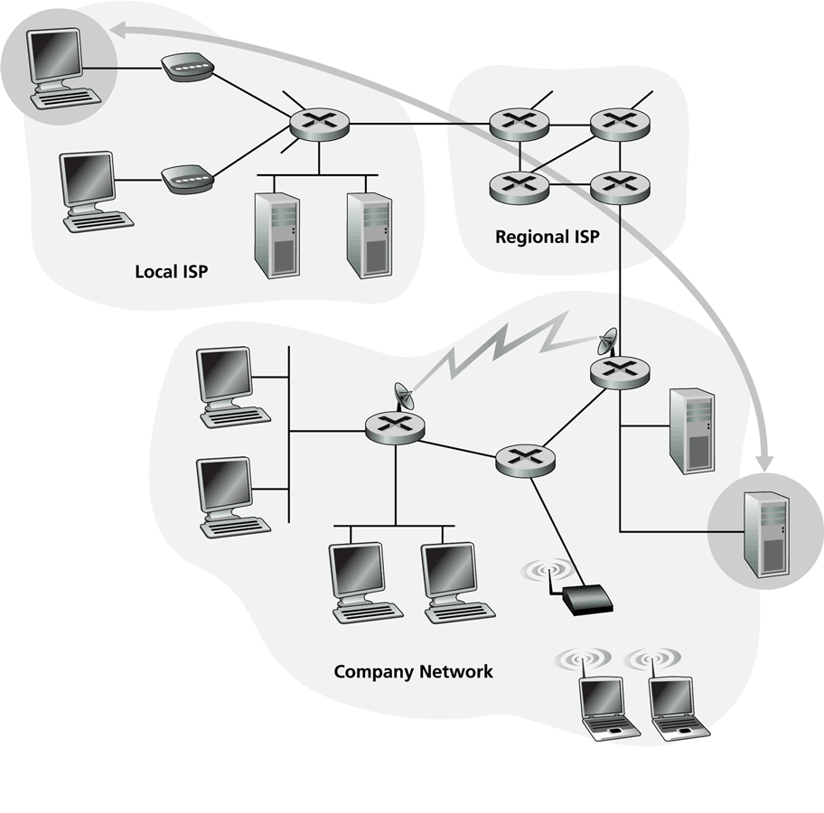

# Redes - Introducción

- 🖨️ [01 - Introducción parte 1](https://tecnologoinformatico.github.io/redes-de-computadoras/diapositivas/01_Introduccion-1.pdf)
- 🖨️ [02 - Introducción parte 2](https://tecnologoinformatico.github.io/redes-de-computadoras/diapositivas/02_Introduccion-2.pdf)

Internet es una red de computadoras que interconecta a millones de dispositivos informáticos a lo largo del mundo.

A diferencia de la red telefónica, que durante años en la mayoría de los países estuvo a cargo de una sola compañía, Internet global consiste en decenas de miles de redes interconectadas operadas por proveedores de servicios, compañías individuales, universidades, gobiernos y otros.

Los estándares abiertos permiten que esta red de redes puede comunicar. Esto hace posible que cualquiera pueda crear contenido, ofrecer servicios y vender productos sin requerir el permiso de una autoridad central.

- [Internet Society](https://www.internetsociety.org/es/internet/)

## Componentes

### Frontera

(Hosts y aplicaciones)

Hasta hace algunos años los dispositivos conectados en internet eran principalmente PC's y servidores alojando páginas web y/o proveyendo servicios de mensajería de correo electrónico.

Actualmente cada vez más terminales no tradicionales están conectados a internet, entre los que se pueden mencionar televisores, consolas, dispositivos de seguridad, electrodomésticos inteligentes y por supuesto teléfonos inteligentes (smart phones).

Para denominar a estos dispositivos utilizaremos el termino hosts o sistemas terminales. Los sistemas terminales intercambian datos segmentandolos y añadiendo cierta información en la cabecera de cada segmento denominado paquete.
Una vez los paquetes arriban al sistema terminal receptor los reensambla para obtener los datos originales.

### Redes de Acceso

(Enlaces)

La comunicación se realiza mediante una red de enlaces de comunicaciones y dispositivos de conmutación de paquetes. Los enlaces estan compuestos por variados medios físicos, entre los que cabe mencionar cable coaxial, hilo de cobre, fibra óptica y el espectro de radio, cada uno de ellos con sus particularidades y distinta velocidad de transmisión.

### Nucleo

(Routers)

Un conmutador de paquetes toma el paquete que llega de uno de sus enlaces de comunicación de entrada y lo reenvía a uno de sus enlaces de comunicación de salida. Los conmutadores más utilizados en internet son los routers y los switches de la capa de enlace. La secuencia de enlaces de comunicaciones y conmutadores de paquetes que atraviesa un paquete desde el host emisor hasta el receptor se conoce como ruta.

## Servicios

Brindados mediante protocolos o API's

Todos los dispositivos conectados a Internet se comunican siguiendo determinados protocolos que controlan el envío y recepción de los datos. El protocolo TCP (Transmission Control Protocol) y el protocolo IP (Internet Protocol) son dos de los protocolos más importantes de Internet, y se los conoce colectivamente como TCP/IP.

Los protocolos juegan un rol fundamental en Internet, y para que todos estén de acuerdo en el modo de proceder se establecen estándares. Los estándares de Internet son desarrollados por el IETF (Internet Engineering Task Force).

Los documentos asociados a estos estándares IETF se conocen como documentos RFC (Request for Comments).

A su vez los programadores de aplicaciones de red brindan API's (Application Programming Interface), permitiendo así que otras aplicaciones interactuen con las funciones que se han implementado, pudiendo consumir servicios o reutilizar determinadas funciones y recursos.

Entre los servicios brindados en Internet se pueden destacar:

- El E-mail, uno de los primeros y más valiosos servicios desde el origen de las redes de computadoras.
- Acceso remoto.
- Transferencia de archivos.
- World Wide Web.

## Arquitectura

Dentro de los modelos de diseño de aplicaciones en la red
podemos encontrar dos grandes paradigmas:

- Cliente servidor
- P2P (peer to peer)

En el caso de la arquitectura cliente servidor hay dos categorías de hosts que cumplen un rol bien específico.
El servidor será un equipo de alta disponibilidad, accesible a traves de una IP fija, que brindará determinado servicio.
Por su parte el cliente se compondrá de equipos variados, probablemente con IP dinámica y haciendo uso del servicio de forma intermitente. En este caso los clientes realizarán peticiones al servidor, consumirán sus servicios, pero no interactuarán directamente con otros clientes.

En el caso de la arquitectura P2P (peer to peer), no se dispone de un equipo central, sino que los usuarios de la red funcionan como cliente o servidor de forma alternativa interactuando entre sí.

## Proveedores de Servicios

Los sistemas terminales acceden a Internet a través de los ISP ( Internet Service Provider). Cada ISP es compuesto por una red de conmutador de paquetes y enlaces de comunicación, esta red se comunica con otros ISP para lograr la intercomunicación que da lugar a Internet.

Servicios brindados:

- DSL: digital subscriber line
  - ADSL
  - SDSL
- HFC: Hybrid fiber coax
- Fiber to the home

### Tiers

Los proveedores de Internet mantienen una estructura jerarquica.
En el núcleo se encuentran los ISP Tier I, los cuales brindan servicios a nivel global y cuentan con enlaces de alta velocidad. Los ISP Tier I le brindan servicio de conexión a los Tier II (regionales) y estos a su vez a los Tier III (regionales y locales).

  Jerarquía de proveedores de servicios.

    - Tier I
    - Tier II
    - Tier III

## Enlaces

- [DSL Interference](http://www.arrl.org/dsl-interference)
