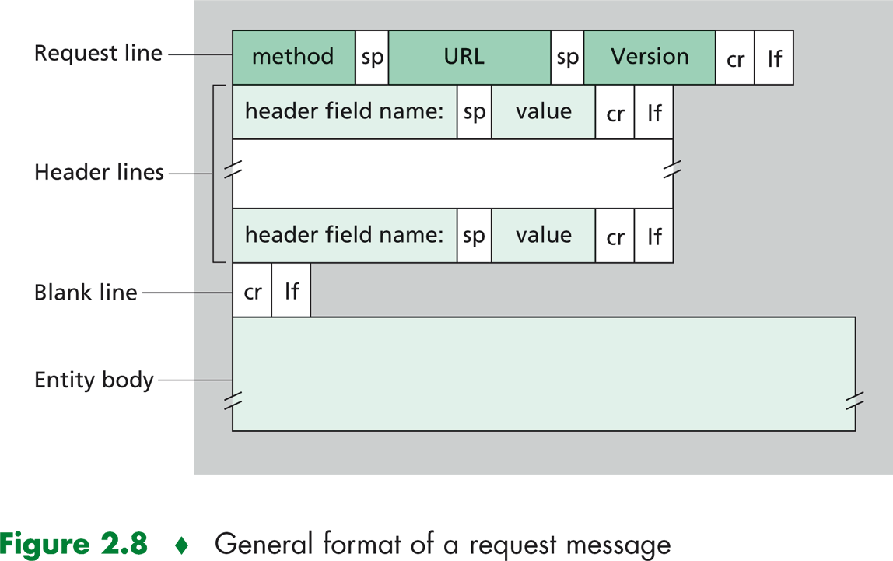
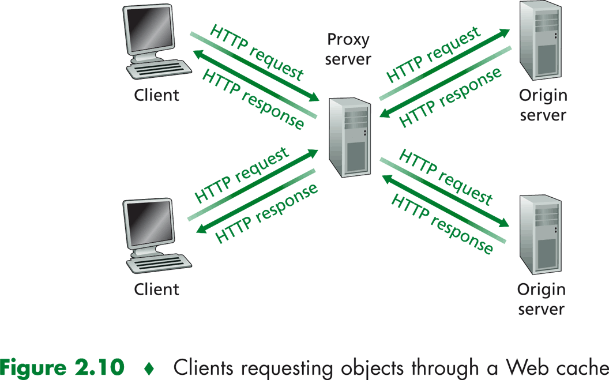
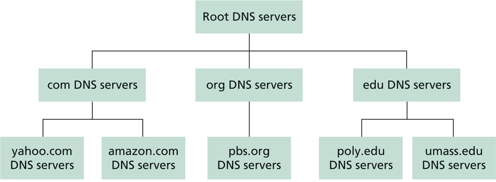

# Capa de Aplicación

La capa de aplicación esta formada por programas que se ejecutan en sistemas terminales, hosts, conectados en red.

Una aplicación de red consta de parejas de procesos que se envían mensajes entre sí por medio de la red.

*Ejemplo: Un navegador Web Mozilla Firefox comunicándose con un servidor web Apache.*

Por lo general esta interacción se realiza de modo en que un host realiza una petición y utiliza un servicio brindado por otro host, donde al que realiza la petición (inicia la comunicación), se le llamará cliente y al que brinda el servicio (espera la comunicación de un proceso cliente), servidor. En el ejemplo anterior el navegador funciona como programa cliente y el servidor Apache tal como su nombre lo indica, de servidor.

Los procesos envían y reciben mensajes a través de sockets, lo cual se puede pensar como una puerta de comunicación. El proceso que envía datos deja mensajes en el socket y confía en el servicio brindado por las capas inferiores para que el mensaje llegue al proceso destino.

Cada host puede ser identificado por una dirección IP, pero para identificar a los procesos, ya que pueden ser muchos funcionando en un mismo host, es necesario otro identificador. Para esto se utilizan números que se asocian a los procesos, los cuales se denominan puertos.

Para que los mensajes sean entendidos por el servidor que los recibe, y correctamente respondidos, debe existir un protocolo, donde se definirán tipos de mensajes, campos y parámetros que deben ser enviados, así como el modo de hacerlo.

Entre estos protocolos pueden ser de dominio público o propietarios. Entre los de dominio público se encuentran los definidos en los RFC (Request For Comments), HTTP, SMTP, FTP, SSH, etc.

## Arquitecturas

El desarrollador de una aplicación debe pensar el mejor modo en que los hosts se comunicarán y que rol cumplirán. Uno de los grandes enfoques que se pueden tener en cuenta son las arquitecturas, en las que en Internet predominan: cliente servidor y P2P.

### Cliente servidor

En la arquitectura cliente servidor, el servidor es un equipo de alta disponibilidad, que aguarda por solicitudes de los clientes en una dirección IP fija. Por su parte los clientes pueden estar activos de forma intermitente. Normalmente un sólo host no es suficiente para responder a la solicitud de todos los clientes, así mismo no serían posible brindar la misma calidad de servicio para todos los rincones geográficos, para esto se suele implementar una granja de servidores (cluster), para crear un servidor virtual de alta capacidad, y se realiza una replicación en distintos puntos para mejorar la velocidad de acceso y la disponibilidad del servicio.

Por su parte los clientes se encuentran activos de forma intermitente, no tienen necesariamente IP fija y utilizan variado hardware y sistemas operativos, así como en el caso de la Wold Wide Web, pueden utilizar distintas aplicaciones para entablar la comunicación. Los clientes no se comunican de forma directa entre sí, sino que siempre lo harán a través del servidor.

Se debe notar que un sistema de gran porte con este tipo de arquitectura puede llegar a ser sumamente costoso, tanto desde el hardware, el ancho de banda y el mantenimiento a realizar. Actualmente existen servicios de máquinas virtuales en la nube donde se puede escalar una aplicación con gran facilidad y reduciendo costos, lo cual suele denominarse cloud service (servicio de nube).

Ejemplos de servicios en la nube:

- [Amazon Web Services (AWS) - Cloud Computing Services](https://aws.amazon.com/es/what-is-aws/)
- [Microsoft Azure - Servicios en la nube](https://azure.microsoft.com/es-es/overview/what-is-azure/)
- [Google Cloud Platform](https://cloud.google.com/docs/?hl=es)

Servicios brindados con esta arquitectura son:

- Correo electrónico
- Páginas web
- Almacenamiento de archivos centralizado

### Peer to Peer (P2P)

Por su parte una red P2P estará conformada por host que funcionarán como cliente y servidor de forma alternativa conectándose directamente entre sí. Este sistema es de muy alta escalabilidad, creciendo su disponibilidad de forma natural a la vez que aumenta la demanda. Por otro lado puede ser muy difícil de administrar y en la mayoría de los casos será necesario contar con algún servidor que facilite la conexión entre los pares y la localización de recursos.

Algunos servicios que utilizan esta arquitectura son:

- bittorrent
- Skype
- bitcoin
- SETI@Home

## HTTP

En la década de 1990 surgió la aplicación World Wide Web que revolucionó el uso de Internet y lo convirtió en un recurso fundamental para el público general.

El protocolo principal es el HTTP en el que se definen las funciones de un programa cliente y uno servidor. El funcionamiento básico es el pedido al servidor de un recurso página web, el servidor procesa la petición y retorna el archivo, y finalmente el navegador interpreta la estructura y lo muestra. Una página web es un contenedor de objetos estructurada en HTML (HyperText Markup Language), la cual puede hacer referencia a archivos multimedia, scripts y otros archivos.

Cada objeto es identificable por una dirección URL (Uniform Resource Locator). Se utiliza el protocolo TCP de la capa de transporte para realizar los pedidos y enviar las respuestas, por defecto los servidores web escuchan mediante el puerto 80 HTTP y 443 HTTPS.

Los mensajes intercambiados se pueden clasificar como pedidos (request) y respuestas (response).

### request



Ejemplo de request:

```HTTP
GET /tecnoinf HTTP 1.1
Host: www.fing.edu.uy
User-agent: Mozilla/4.0
Connection: close
Accept-language: es
```

### response


Ejemplo de response:

```HTTP
HTTP/1.1 304 Not Modified
Connection: Keep-Alive
Date: Thu, 15 Mar 2018 00:15:42 GMT
ETag: "32d-4de09aea58e40"
Keep-Alive: timeout=5, max=100
Server: Apache
```

Al momento de la realización de las peticiones se utiliza un conjunto de métodos para indicar la acción que se desea realizar para un recurso determinado. Aunque estos también pueden ser sustantivos, estos métodos de solicitud a veces son llamados HTTP verbs.

- GET
- POST
- HEAD
- PUT
- DELETE

El método **GET** es utilizado para solicitar datos, las peticiones realizadas a través de este método pueden ser cacheadas y almacenadas en el historial del navegador. No es utilizado para el envío de datos sensibles, como credenciales, por el hecho de que los parámetros viajan en la ruta, por otro lado eso mismo lo hace muy útil para ser utilizado en filtros.

Por su parte el método **POST**, es utilizado para el registro de datos, la información enviada viaja en el cuerpo del mensaje y no tiene limites de tamaño. en este caso las peticiones nunca son cacheadas.

Las peticiones son respondidas por parte del servidor junto a un [código de estado](https://developer.mozilla.org/es/docs/Web/HTTP/Status "Códigos de estado de respuesta HTTP") que indica si el procedimiento fue exitoso o no. Las respuestas se agrupan en cinco clases: respuestas informativas, respuestas satisfactorias, redirecciones, errores de los clientes y errores de los servidores.

### Códigos de estado

#### Respuestas informativas

100 Continue

Esta respuesta provisional indica que todo hasta ahora está bien y que el cliente debe continuar con la solicitud o ignorarla si ya está terminada.

101 Switching Protocol

Este código se envía en respuesta a un encabezado de solicitud Upgrade por el cliente e indica que el servidor acepta el cambio de protocolo propuesto por el agente de usuario.

102 Processing

Este código indica que el servidor ha recibido la solicitud y aún se encuentra procesandola, por lo que no hay respuesta disponible.

#### Respuestas satisfactorias

200 OK

La solicitud ha tenido éxito. El significado de un éxito varía dependiendo del método

201 Created

La solicitud ha tenido éxito y se ha creado un nuevo recurso como resultado de ello. Ésta es típicamente la respuesta enviada después de una petición PUT.

202 Accepted

La solicitud se ha recibido, pero aún no se ha actuado.

#### Redirecciones

301 Moved Permanently

La respuesta indica que la URI de la petición ha cambiado, posiblemente se incluya en la respuesta la nueva ubicación.

#### Errores de cliente

400 Bad Request

El servidor no puede entender la petición o contiene una sintaxis inválida

404 Not Found

El recurso no ha sido encontrado

#### Errores de servidor

500 Internal Server Error

### Cookies

Las cookies son datos que el servidor envía junto con la respuesta al navegador, estos datos se enviarán junto con las siguientes peticiones, lo que permite realizar un seguimiento de estado sobre el protocolo HTTP el cual no contiene estado. Por lo general es utilizado para mantener una sesión de un usuario (Autenticación - logged-in), así como para mantener información de acciones realizadas.

Es posible asignarles un tiempo máximo de vida, que expiren al cerrar el navegador o realizar un borrado manual (cerrar sesión) por parte del servidor.

Así mismo cuenta en algunos casos con mala reputación por el uso que se le puede dar de realizar seguimiento en los hábitos de navegación con fines de recopilación de datos para diversos usos. En algunos casos es posible utilizar otros mecanismos para guardar información en el cliente, como el uso de [Web Storage](https://developer.mozilla.org/en-US/docs/Web/API/Web_Storage_API "Web Storage API").

### Caché web

El caché web almacena documentos web para reducir el ancho de banda consumido, la carga de los servidores y el retardo en la descarga.

- privados
  - Funcionan para un único usuario
- compartidos
  - Utilizados por proveedores de servicios e instituciones para ahorrar ancho de banda.
- pasarela
  - Funcionan a cargo del servidor original, pueden implementar una CDN (Content Delivery Network)

Lo que hace viable el uso del un web cache es la existencia de un GET condicional, lo que se logra a través de un campo en la cabecera `if-modified-since` que en caso de que no se haya modificado el objeto desde la fecha pasada se retorna únicamente la cabecera con código 304 cargando el documento previamente almacenado en caché, de lo contrario se envía todo el documento.

Esto puede ser muy útil para ahorrar ancho de banda para proveedores de servicios, tales como instituciones educativas o empresas, por lo que puede ser que cuenten con un servidor proxy que satisfaga las peticiones del cliente sin involucrar el servidor original.

Se puede configurar el navegador para que acceda mediante chaché. El navegador envía todos los pedidos al  caché, si el objeto se encuentra se devuelve del caché Si no se encuentra se obtiene del cliente original, se guarda en el server proxy y se devuelve al usuario.



Otro ejemplo de implementación de este tipo es el caso de los CDN (Content Delivery Network), en el que se cuenta con una copia de los datos de forma distribuida en distintos puntos de la red.

Un cliente accede a los datos desde un nodo cercano, reduciendo así el tiempo de respuesta y la pérdida de información, y reduciendo la carga de los servidores.


## API

Application Programming Interface

Interfaz mediante la cual un software brinda determinados servicios para ser consumidos por otra aplicación.
Contiene un conjunto de reglas y especificaciones para que los programas se puedan comunicar.

### Web APIs

Conjunto de Especificaciones que determinan el modo de realizar una petición (request message),
y la estructura de respuesta que se espera obtener (response).

Usualmente se utiliza el formato XML (Extensible Markup Language) o JSON (JavaScript Object Notation).

#### SOAP

Especificación de protocolo para el intercambio de mensajes.
Protocolo basado en XML consistente en:

- Una envoltura o sobre, que define la estructura del mensaje y el modo de procesarlo.
- Un conjunto de reglas para representar instancias de tipos
- Una convención para representar peticiones y respuestas

Características:

- Expansibilidad
- Neutralidad (puede operar sobre diversos protocolos como HTTP, SMTP)
- Independencia

Una de sus mayores desventajas es que la serialización y des serialización de XML puede tener un gran impacto de performances.

#### REST (REpresentational State Transfer)

Mejora la performance, escalabilidad y es más flexible.
Se utilizan las operaciones disponibles en HTTP

- GET
- POST
- PUT
- DELETE, etc.

Las funcionalidades y los datos son considerados como recursos, accesibles mediantes URIs (Uniform Resource Identifiers)

Ejemplo: `/alumnos/32` (recurso alumno con identificador 32)

Se cumplen determinados principios para que una aplicación sea simple, ligera y rápida.

- Identificación de recursos mediante URI
- Interfaz uniforme
- Mensajes auto descriptivos
- Interacción estática

## DNS

Los usuarios utilizan nombres fáciles de recordar para acceder a los servicios que brindan los hosts en lugar de la dirección IP. Para que esto sea posible debe existir un sistema que realice una traducción de dichos nombres en las direcciones IP, y esa es la principal tarea del Domain Name System `DNS`.

Se trata de una base de datos distribuida implementada en una jerarquía de servidores, junto a un protocolo de la capa de aplicación que permite consultar los registros.

Por ejemplo al momento de acceder a un sitio, el navegador realiza una consulta a un cliente DNS que corre en el propio equipo, el cliente DNS envía la consulta con el nombre de host a un servidor DNS el cual retornará, entre otra información útil, la dirección IP correspondiente al nombre de host consultado.

La elección de una base de datos descentralizada se da por entre otros factores en el hecho de evitar un punto de falla único, dado que la función que se brinda es vital para el correcto uso de la World Wide Web, así como que sería muy difícil soportar el elevado volumen de tráfico. De este modo se mejora el mantenimiento, la escalabilidad del sistema, y el acceso sin mayor retardo desde los distintos rincones del planeta.

### Servicios DNS

Además de la traducción de nombres en direcciones IP se proporcionan otros servicios importantes.

Hay equipos que por motivos administrativos u otras cuestiones cuentan con un nombre complicado, que tampoco los hace muy fácil de utilizar, el servicio DNS puede realizar un  **alias de host** para esto se utiliza un registro `CNAME`. A su vez es posible que se desee acceder a un sitio mediante pequeñas variantes de forma transparente para el usuario, por ejemplo, www.misitio.com.uy puede enlazar con www.misitio.uy

Así mismo sucederá que el propietario del sitio misitio.uy quiera tener un correo @misitio.uy, en este caso se podrá hacer mediante un registro `MX`. Cabe destacar que el host para alojar el sitio web no necesariamente será el mismo que alojará el servidor de correo electrónico.

DNS también es utilizado para distribuir la carga de un sitio distribuido. En casos en los que un servicio recibe una gran carga de tráfico se utilizan replicas en hosts distribuidos, cada uno con su propia IP. En este caso el servidor DNS devolverá una lista de direcciones IP rotando su orden, distribuyendo el tráfico entre los distintos hosts disponibles.

### Jerarquía



La base de datos está distribuida al rededor de todo el mundo y de forma jerarquizada. Ningún servidor cuenta con todos los registros, sino que existen distintos niveles de dominio.

Por ejemplo, se desea acceder al sitio www.tecnologo.com. En primer lugar el cliente deberá recurrir a uno de los servidores raíz, este le devuelve las direcciones IP para los servidores TLD .com. Al consultar uno de estos servidores se retornará la dirección o las direcciones IP de un servidor autoritativo para tecnologo.com. Así el cliente puede consultar a uno de los servidores autoritativos para tecnologo.com el cual le devolverá la IP correspondiente al host www.tecnologo.com.

#### Servidores DNS raíz

Existen 13 servidores DNS raíz, nombrados con letras desde la A hasta la M. Cada uno de estos servidores se encuentra replicado en distintas ubicaciones geográficas, tanto por motivos de seguridad como de fiabilidad.

#### Servidores TLD (Top Level Domain)

Los servidores TLD son responsables de los dominios de nivel superior como, .com, .net, .edu y todos los dominios de nivel superior de los paises, tales como .uy, .uk, .fr, etc.

#### Servidores DNS autoritativos

Las organizaciones que cuenten con hosts accesibles desde Internet deben proporcionar un listado de sus hosts dentro del dominio, esto se hace a través de los servidores autoritativos brindando registros DNS que corresponden nombres de hosts con direcciones IP.

#### Servidor DNS local

Fuera de la jerarquía antes mencionada existen servidores DNS locales mantenidos por los proveedores de servicios, de este modo el servidor local puede resolver consultas realizadas por los usuarios, almacenar las respuestas en el caché y brindar una respuesta más rápida en próximas peticiones. De este modo actúa como proxy, reenvía la consulta a la jerarquía de ser necesario.

### Resolución iterativa


### Resolución recursiva


### Registros DNS

Los servidores DNS almacenan los **registros de recursos** con cuatro campos:

- Nombre
- Valor
- Tipo
- TTL

El campo TTL es el tiempo de vida del registro, determina cuando un recurso debería ser eliminado del caché.

En el caso del campo tipo los valores pueden ser:

#### Tipo A

- Nombre: el del equipo
- Valor: dirección IP

#### Tipo NS

- Nombre: el dominio
- valor: El nombre del servidor autoritativo para el dominio.

#### Tipo CNAME

- Nombre: alias para un nombre “canónico” real. www.ibm.com es realmente servereast.backup2.ibm.com
- Valor: el nombre canónico real

#### Tipo MX

- Valor: el nombre del servidor de
- correo asociado con el nombre.

Entre otros: PTR, SOA, HINFO, TXT, LOC, WKS, SRV, SPF

## Enlaces

- [DNS | Root servers](http://root-servers.org)
- [DNS | Consultas recursivas e iterativas](https://technet.microsoft.com/en-us/library/cc961401.aspx)
