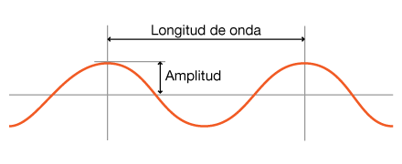
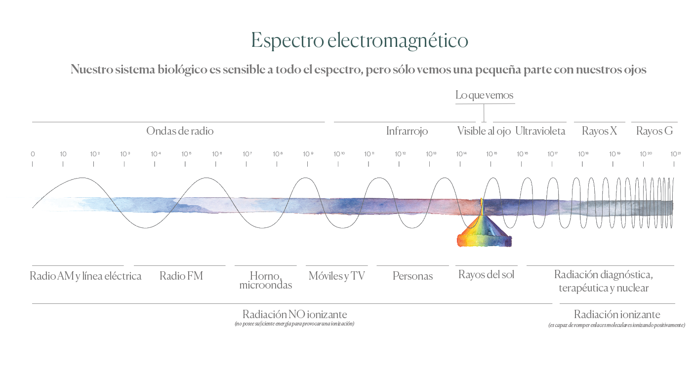
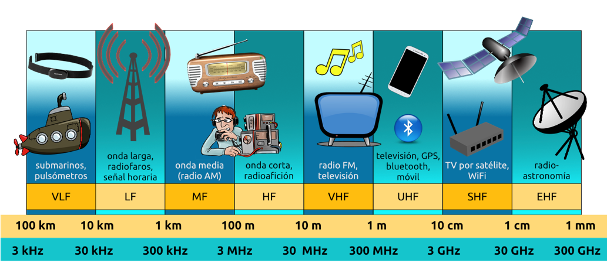

# Redes inalámbricas

Las redes inalámbricas están compuestas por hosts y enlaces inalámbricos, los cuales pueden estar conectados o no a una estación base. En caso de contar con una estación base se dice que la red opera en **modo de infraestructura**, por otro lado en caso de no contar con la infraestructura, serán los propios nodos quien deban suministrar los servicios de enrutamiento y asignación de direcciones, y en este caso la red estaría operando en modo  **ad-hoc**.

La comunicación inalámbrica surge principalmente para hacer posible la comunicación de dispositivos portátiles o móviles, de todos modos los dispositivos fijos en ocaciones también son beneficiados, por ejemplo en los casos en que la situación geográfica hace inviable el despliegue de estructuras cableadas, como puede ser en montañas, selvas, pantanos, etc. Es destacable el hecho de que la comunicación digital inalámbrica moderna se haya iniciado en las islas de Hawai.

## Espectro electromagnético

Cuando los electrones se mueven crean ondas electromagnéticas que se pueden propagar en el espacio libre (aún en el vacío).
El físico británico James Clerk Maxwell predijo estas ondas en 1865, y Heinrich Hertz las produjo y observó por primera vez en 1887.
La cantidad de oscilaciones por segundo de una onda electromagnética es su frecuencia, *f*, y se mide en *Hz* (en honor de Heinrich Hertz). La distancia entre dos máximos (o mínimos) consecutivos se llama *longitud de onda* y se designa de forma universal con la letra griega λ *lambda*.

Al conectarse una antena del tamaño apropiado a un circuito eléctrico, las ondas electromagnéticas se pueden difundir de manera eficiente y captarse por un receptor a cierta distancia. Toda la comunicación inalámbrica se basa en este principio.

En el vacío, todas las ondas electromagnéticas viajan a la velocidad de la luz, c, es aproximadamente 3x10^8 m/s, o de casi 30cm por nanosegundo. En el cobre o en la fibra, la velocidad baja a casi 2/3 de este valor y se vuelve ligeramente dependiente de la frecuencia.

Dentro del espectro electromágnetico, las porciones de radio, microondas, infrarrojo y luz visible del espectro pueden servir para transmitir información modulando la amplitud, la frecuencia o la fase de las ondas. La luz ultravioleta, los rayos X y los rayos gamma serían todavía mejores, debido a sus frecuencias más altas, pero son dificiles de producir y de modular, no se propagan bien entre edificios y son peligrosos para los seres vivos.

<!--  -->

## Radiotransmisión

Las ondas de radio son fáciles de generar, pueden viajar distancias largas y penetrar edificios sin problemas, por lo que se utilizan mucho en la comunicación interior y exterior. Las ondas de radio también son omnidireccionales, lo que significa que viajan en todas direcciones desde la fuente, por lo que le transmisor y el receptor no tienen que alinearse con cuidado físicamente. Por lo general esta característica es beneficiosa.

Las propiedades de las ondas de radio dependen de la frecuencia. A bajas frecuencias las ondas de radio cruzan bien los obstáculos, pero la potencia se reduce drásticamente con la distancia a la fuente. A frecuencias altas, las ondas de radio tienden a viajar en línea recta y a rebotar en los obstáculos.
También son absorbidas por la lluvia. En todas las frecuencias, las ondas de radio están sujetas a interferencia por los motores y otros equipos eléctricos.
Por la capacidad del radio de viajar distancias largas, la interferencia entre usuarios es un problema. Por esta razón los gobiernos legislan estrictamente el uso de radiotransmisores. En Uruguay este organizmo es la [URSEC](https://www.gub.uy/unidad-reguladora-servicios-comunicaciones/).

## Características

### Intensidad decreciente de la señal

Las características de las redes inalámbricas al funcionar sobre un medio no guiado, llevan a que deban superar mayores dificultades que las presentes en las redes cableadas. La intensidad d ela señal se pierde a medida que se viaja por el medio y sobretodo al chocar contra obstáculos. A este efecto se le conoce como pérdida de propagación (*path loss*)

### Interferencia de otros origenes

### Propagación