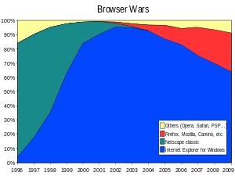
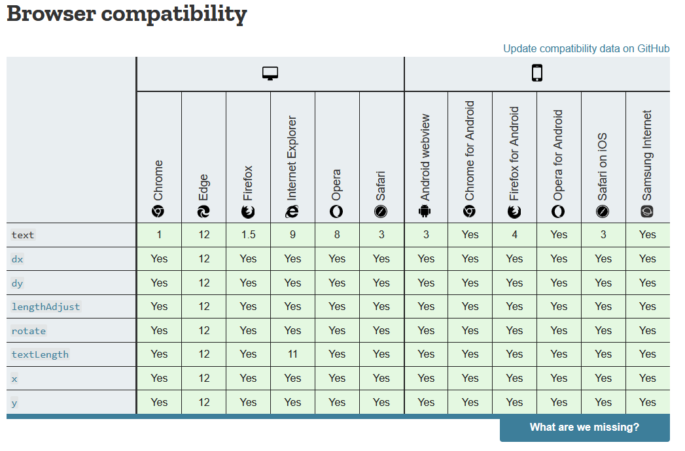

# Browsers, navegadores web

Los navegadores web son el más común punto de acceso a la web para muchos usuarios.

Los navegadores web son aplicaciones que proveen acceso hacia un servidor web, enviando solicitudes hacia una `URL`, obteniendo recursos y reprecentandolos de una forma iteractiva.

    La evolución de los navegadores web a llevado a que muchos [clientes gruesos](https://www.computerhope.com/jargon/t/thickcli.htm) hayan sido reemplazados por navegadores.

Algunos navegadores actuales:

- Google Chrome
- Microsoft Edge
- Microsoft Internet Explorer
- Mozilla Firefox
- Opera
- Apple Safari
- Brave
- Vivaldi
- Amazon Silk

## Función del navegador

La función principal de un navegador es presentar un recurso web elegido por el usuario, solicitandolo a un servidor y desplegandolo en la pantalla.
El recurso usualmente es un documento HTML, pero puede ser así mismo un documento PDF, una imagen u otro tipo de contenido.

La ubicación del contenido es especificada por el usuario utilizando una URI, (Uniform Resource Identifier).

Formato de una URL: `[esquema]://[dominio][puerto]/[path]?[queryString]#[identificador]`

[¿Cual es la diferencia entre URI, URL y URN?](#diferencia-entre-uri-url-y-urn)

Existen especificaciones `HTML` y `CSS` para determinar el modo en que un navegador interpreta y muestra los archivos HTML, estas son mantenidas por la organización **W3C** [(World Wide Web Consortium)](https://www.w3.org/), organización encargada en establecer los estándares para la web.

Durante años los navegadores implementaban sólo una parte de las especificaciones, y a su vez desarrollaban sus propias extensiones, lo que causaba serios problemas de compatibilidad, y grandes dolores de cabeza para los desarrolladores web.

Hoy en día la mayoría de los navegadores se implementan de un modo mayor o menor siguiendo las especificaciones estandarizadas.

Hay varios sitios donde se puede hacer un relevamiento de si determinadas features son implementadas en determinado navegador, por ejemplo [caniuse.com](https://caniuse.com/) o en los distintos artículos de [MDN](https://developer.mozilla.org/en-US/docs/Web/SVG/Element/text#Browser_compatibility).

La interfaz de los navegadores suele tener unas características comunes en todos, entre estos elementos se encuentran:

- Una barra de direcciones para ingresar la URI.
- Botones para ir hacia atrás y adelante.
- Marcadores o favoritos.
- Botones para refrescar y detener la carga de documentos.
- Botón Home.

Curiosamente la interfaz de los navegadores no se encuentra especificada, simplemente se ha ido generando a partir de las buenas prácticas desarrolladas a lo largo de los años de experiencia en el uso, y esto ha sido imitado entre los diversos navegadores.

En la especificación de HTML5 sin embargo se mencionan elementos comunes que los navegadores suelen tener, de todos modos cada navegador a su vez implementa características únicas de modo de atraer a los usuarios.

## Estructura

### La interfaz de usuario

Esto incluye la barra de navegación, los botones para avanzar y retroceder, menú de marcadores, etc. Cada parte del navegador que se muestra, a excepción de la ventana donde se despliega la página solicitada.

### El motor de navegación

Provee una interfaz entre la interfaz de usuario y el motor de renderizado, basado en la interacción del usuario. Provee un método para iniciar y cargar una URL, y manejar de forma correcta la recarga y la navegación hacia adelante y hacia atrás.

### El motor de renderización

Es responsable de desplegar el contenido solicitado. Por ejemplo si se solicita un archivo HTML, realizará el renderizado del HTML y el CSS y desplegará el contenido parseado en la pantalla.

### Red

Para todas las llamadas de red tales como request HTTP, utilizando diferente implementación para cada plataforma, a travez de una interfaz independiente.

### UI backend

Utilizada para dibujar elementos básicos de la interfaz, tales como combo box y ventanas. Se expone una interfaz genérica que no es espécifica de ninguna plataforma. Por debajo utiliza métodos de la interfaz de usuario propia del sistema operativo.

### Interprete Java Script

Utilizado para parsear y ejecutar javascript.

### Almacenamiento de datos

Capa de percistencia donde el servidor almacena los datos que podrían ser necesario persistír, tales como cookies.
Los navegadores a su vez soportan mecanismos de almacenamiento tales como localStorage, IndexedDB, WebSQL y ficheros del sistema.

## Diferencia entre URI URL y URN

RFC 3986:

    A URI can be further classified as a locator, a name, or both. The term "Uniform Resource Locator" (URL) refers to the subset of URIs that, in addition to identifying a resource, provide a means of locating the resource by describing its primary access mechanism (e.g., its network "location"). The term "Uniform Resource Name" (URN) has been used historically to refer to both URIs under the "urn" scheme [RFC2141], which are required to remain globally unique and persistent even when the resource ceases to exist or becomes unavailable, and to any other URI with the properties of a name.

Por lo tanto, todas las **URL**s son **URI**s, o casi siempre, y todas las **URN**s son **URI**s.

- **URI** => **Uniform Resource Identifier**, dirección completa de un recurso.
  - `https://www.fing.edu.uy/tecnoinf/sanjose/index.html`
- **URL** => **Uniform Resource Locator**, ubicación de un recurso.
  - `https://www.fing.edu.uy/`
- **URN** => **Uniform Resource Name**, nombre del recurso.
  - `/tecnoinf/sanjose/index.html`

## Enlaces

- [Evolución de los navegadores](https://grosskurth.ca/papers/browser-archevol-20060619.pdf)
- [Renderización crítica](https://developers.google.com/web/fundamentals/performance/-critical-rendering-path/)
- [Spec HTML5](https://dev.w3.org/html5/spec-LC/)
- [Como funcionan los navegadores](https://www.html5rocks.com/en/tutorials/internals/howbrowserswork/)
